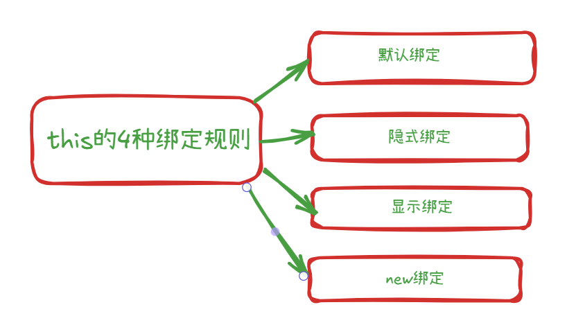
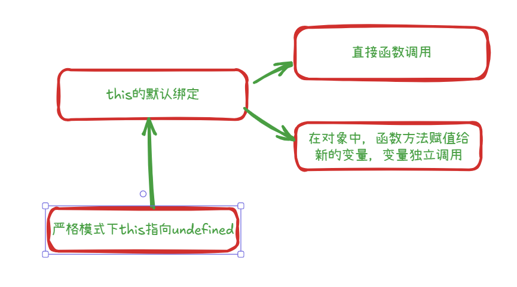
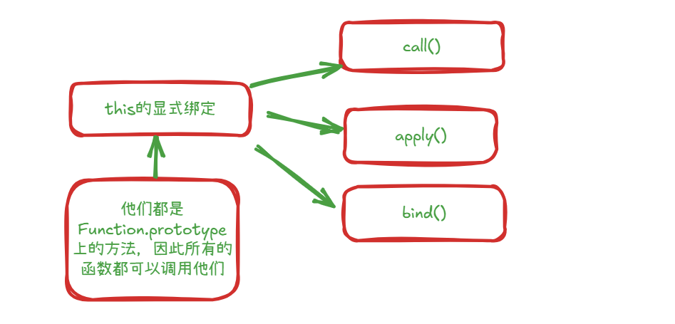
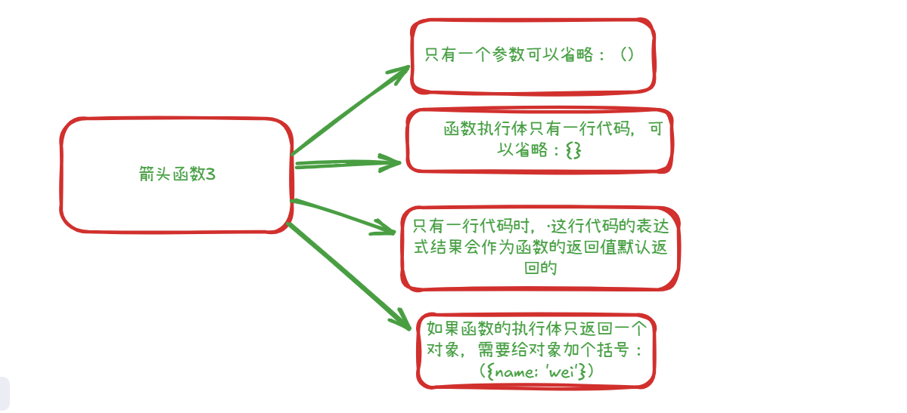

# this的认识
1. 函数在调用时会默认绑定一个this，this是在运行时被绑定的
2. this的绑定和编写位置无关，和调用方式有关
3. this的指向为 对象 或 undefined|null

# this 的绑定


# this 默认绑定情况


# 默认绑定几种调用方法
```js
//1. 普通函数，独立调用
function foo() {
  console.log('foo this :', this)
}
foo()

//2. 定义在对象种，但是独立调用
var obj ={ 
  name: 'why',
  bar: function () {
    console.log('bar this:', this)
  }
}
var baz = obj.bar
baz()

//3. 高阶函数
var obj1 = {
  bar: function() {
    console.log('obj1 bar this:', this)
  }
}
function test(fu){
  fun()
}
test(obj1.bar)
```

# this的隐式绑定


```js
//调用情况 1
function foo() {
  console.log('foo this:', this)
}
var obj = {
  name: 'why',
  foo: foo
}
obj.foo()

//调用情况 2
function foo2() {
  console.log('foo2 this:', this)
}
var obj2 = {
  name: 'obj2',
  foo: foo
}
var obj3 = {
  name: 'obj3',
  obj2: obj2
}
obj3.obj2.foo()
```

# this 的new绑定
```js
function foo() {
  // 3. 函数体执行：此时的 'this' 已经被 new 绑定到了新创建的对象上
  console.log('foo Function:', this); // 输出: foo {} (或类似的对象表示，取决于环境)
  // 4. 修改 'this'：给这个新对象添加一个 'name' 属性
  this.name = 'why';
}

// 1. 调用方式：使用 'new' 关键字调用函数 foo
// 2. 'new' 的操作开始...
const instance = new foo(); // 'new foo()' 表达式执行

// 5. 'new' 操作完成，返回新创建并被修改过的对象
console.log('Instance:', instance); // 输出: Instance: { name: 'why' }
console.log(instance.name);       // 输出: why
```
#### 讲解 this 的 new 绑定：

当一个函数（在这里是 foo）通过 new 关键字来调用时，会发生以下一系列特定的步骤，其中最关键的一步就是 this 的绑定：

#### 1. 创建新对象：首先，new 操作符会创建一个全新的、空的 JavaScript 对象。可以想象成内部执行了类似 let obj = {}; 的操作。

#### 2. 设置原型链：这个新创建的对象的 [[Prototype]]（内部原型，可以通过 __proto__ 或 Object.getPrototypeOf() 访问）会被链接到构造函数（foo）的 prototype 属性。即 Object.setPrototypeOf(obj, foo.prototype);（概念上的等价操作）。

#### 3. 绑定 this：这是 new 绑定规则的核心。构造函数 (foo) 会被调用，并且其内部的 this 关键字会被强制绑定到在第一步中创建的那个新对象上。

#### 4. 执行函数体：foo 函数内部的代码开始执行。

#### 5. 当执行到 console.log('foo Function:', this); 时，因为 this 已经被绑定到了新创建的对象上，所以这里会打印出那个新对象（在很多控制台中，它可能显示为 foo {}，表示一个由 foo 构造函数创建的空对象，因为它还没有 name 属性）。

#### 6. 当执行到 this.name = 'why'; 时，由于 this 指向新对象，这行代码实际上是在给这个新创建的对象添加一个名为 name 的属性，并赋值为 'why'。此时，新对象就变成了 { name: 'why' }。

#### 7. 返回新对象：

#### 8. 如果构造函数 (foo) 没有显式地 return 一个对象类型的值（包括 null），那么 new 表达式会自动返回在第一步中创建并可能在第四步中被修改过的那个新对象。

#### 9. 如果构造函数显式 return 了一个对象，那么 new 表达式的结果就是那个被 return 的对象，而不是第一步创建的新对象。----说明----(这种显式返回对象的行为虽然是 JavaScript 规范允许的，但在实践中相对少见，因为它可能违反了人们对构造函数（旨在初始化 this 并返回它）的通常期望，并且可能破坏原型链（如 instanceof 检查所示）。通常，构造函数要么不写 return，要么只 return this;（虽然这通常是多余的）。)

#### 10. 如果构造函数显式 return 了一个非对象值（如字符串、数字、布尔值、undefined），这个返回值会被忽略，new 表达式仍然返回第一步创建的新对象。

#### 11. 在我们的例子中，foo 函数没有 return 语句（或者说隐式返回 undefined，这是一个非对象值），所以 new foo() 表达式最终返回的是在步骤 1 创建、步骤 4 修改后的新对象 { name: 'why' }。这个对象被赋值给了变量 instance。

总结：

new 绑定规则意味着：当函数通过 new 关键字调用时，函数内部的 this 指向由 new 操作符创建出来的那个全新的对象。 这使得构造函数能够初始化（"构造"）这个新对象，为其添加属性和方法。

这就是为什么通常称这类函数为“构造函数”（Constructor Functions）—— 它们的主要目的是与 new 关键字配合使用，来构造和初始化对象实例。

# 显示绑定


### 三种显式绑定的总结与对比

| 特性          | call()       | apply()           | bind()                   |
| ----------- | ------------ | ----------------- | ------------------------ |
| **执行**      | 立即执行         | 立即执行              | **不立即执行**，返回一个新函数        |
| **this 绑定** | 指定本次调用的 this | 指定本次调用的 this      | **永久**绑定新函数的 this        |
| **参数传递**    | 参数需逐个列出      | 参数以**数组**或类数组形式传递 | 可以预设部分参数 (返回的新函数可接收剩余参数) |
| **返回值**     | 原函数的返回值      | 原函数的返回值           | 一个 this 被绑定的**新函数**

# 1. call() 方法
作用：调用一个函数，并允许你为其指定一个 this 值和一组参数（参数需要逐个列出）。
语法：function.call(thisArg, arg1, arg2, ...)
1. thisArg是对象: 函数执行时内部 this 指向的对象。
2. thisArg是 null 或 undefined：在非严格模式下 this 会指向全局对象（浏览器中是 window，Node.js 中是 global），在严格模式下 this 就是 undefined。
3. thisArg非对象和null和undefined：原始类型值包括：string, number, boolean, symbol, bigint。
无论是否在严格模式下，如果你将一个原始类型值作为 thisArg 传递给 call(), apply(), 或 bind()，这个原始值会被自动转换（包装）成其对应的对象形式。
-   string -> new String(value)
-   number -> new Number(value)
-   boolean -> new Boolean(value)
-   symbol -> Object(value) (Symbol 的包装对象)
-   bigint -> Object(value) (BigInt 的包装对象)
-   这个过程称为“装箱”（Boxing）。

# call()方法的总结
thisArg 类型              | 运行模式     | 函数内部 this 的值           | 说明                    |
| ----------------------- | -------- | ---------------------- | --------------------- |
| null                    | 非严格模式    | 全局对象 (window 或 global) | null 被替换为全局对象         |
| undefined               | 非严格模式    | 全局对象 (window 或 global) | undefined 被替换为全局对象    |
| null                    | **严格模式** | null                   | this 保持为 null         |
| undefined               | **严格模式** | undefined              | this 保持为 undefined    |
| 原始类型 (非 null/undefined) | 任意模式     | 对应的**包装对象**            | 原始值被自动装箱 (Boxing) 成对象 |
| 对象                      | 任意模式     | 传入的对象本身                | 正常的对象绑定

# 2 apply() 的方法
和call()方法一样，不同的地方是传入参数的时候
1.  **call() 方法:**

    -   **语法**: function.call(thisArg, arg1, arg2, ...)
    -   **参数传递**: 除了第一个参数 thisArg（用于指定 this 值）之外，后续的参数需要**逐个地、以逗号分隔**的形式传递给目标函数。

1.  **apply() 方法:**

    -   **语法**: function.apply(thisArg, `[argsArray]`)
    -   **参数传递**: 除了第一个参数 thisArg 之外，它接收**一个数组**（或者一个**类数组对象**，比如 arguments 对象）作为第二个参数。这个数组中的元素会按顺序作为参数传递给目标函数。

# bind()方法
```js
function foo(name, age, address) {
  console.log('foo:', this)
  console.log('参数：', name, age, address)
}
var obj = {name: 'why'}

//返回新的函数，永久绑定obj对象了
var bar = foo.bind(obj, 'wei', 21)

console.log(foo())//foo:全局对象 ||参数： undefined undefined undefinedundefined

bar('zhengzhou')//foo: { name: 'why' } || 参数： wei 21 zhengzhou
```

---

 ### this的四种绑定规则已经全部都讲解完了

 ### 下面讲解this绑定的优先级，相应的面试题了

---

### 四种绑定的优先级 的 总结

**new > 显式绑定 (bind > call/apply 对于后续调用) > 隐式绑定 > 默认绑定**

-   **new 调用？**  this 是新创建的对象。
-   **call, apply 或 bind 调用？**  this 是显式指定的对象。（注意 bind 返回的函数 this 不可再被 call/apply 修改，但可被 new 修改）。
-   **作为对象方法调用 (obj.method())？**  this 是该对象 (obj)。
-   **都不是？**  在严格模式下 this 是 undefined，非严格模式下是全局对象。
-   **箭头函数？**  this 由外层词法作用域决定，忽略以上所有规则。

# 验证`显式绑定`优先于`隐式绑定`
```js
function foo() {
  console.log('this name:',this.name)
}
var obj1 = {
  name: 'why',
  foo: foo
}
var obj2 = {
  name: 'gao'
}
obj1.foo.apply(obj2)//this name: gao
```


# 验证`new绑定`优先于`bind绑定`(apply call 不和new绑定一起使用)

```js
//打印 aaa 说明bind的优先级高，
// 打印全局对象说明new的优先级高
function foo() {
  console.log('foo: ',foo)
}
var bindFn = foo.bind('aaa')
new bindFn() //全局对象 说明是new的优先级高
```

# 验证`显式bind绑定`优先于`显示apply和call绑定`
```js
//先绑定bind
function foo() {
  console.log('this:',this.name)
}
var bindFun = foo.bind({name: 'aaa'})
bindFun.apply({name: 'bbb'})//aaa

//先绑定apply
function foo1() {
  console.log('this:',this.name)
}
 foo1.apply({name: 'aaa'})
var bindFun1 =  foo1.bind({name: 'bbb'})//aaa

//验证call和bind，把上面的apply换成call就可以了
```

# 箭头函数自己的特点，和函数声明，函数表达式的区别
| 特性               | 函数声明                 | 函数表达式                        | 箭头函数                    |
| ---------------- | -------------------- | ---------------------------- | ----------------------- |
| 语法风格             | `function name() {}` | `const name = function() {}` | `const name = () => {}` |
| 是否有函数名           | 有                    | 可有可无（匿名或具名）                  | 通常匿名                    |
| 提升（Hoisting）     | ✅ 会提升，能在定义前调用        | ❌ 不会提升                       | ❌ 不会提升                  |
| `this` 绑定        | 动态绑定，调用时决定           | 动态绑定，调用时决定                   | **词法绑定**，从定义时的作用域继承     |
| 适用场景             | 适用于定义通用函数            | 多用于回调或局部函数                   | 更简洁，常用于简短回调或函数式写法       |
| 能否用作构造函数 (`new`) | ✅ 可以                 | ✅ 可以                         | ❌ 不可以                   |

# 箭头函数的特点

