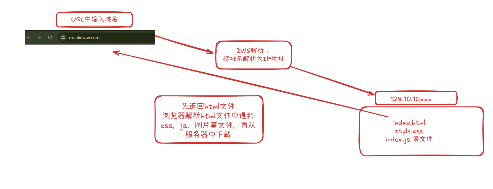
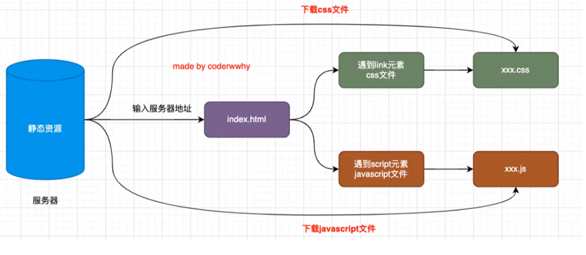
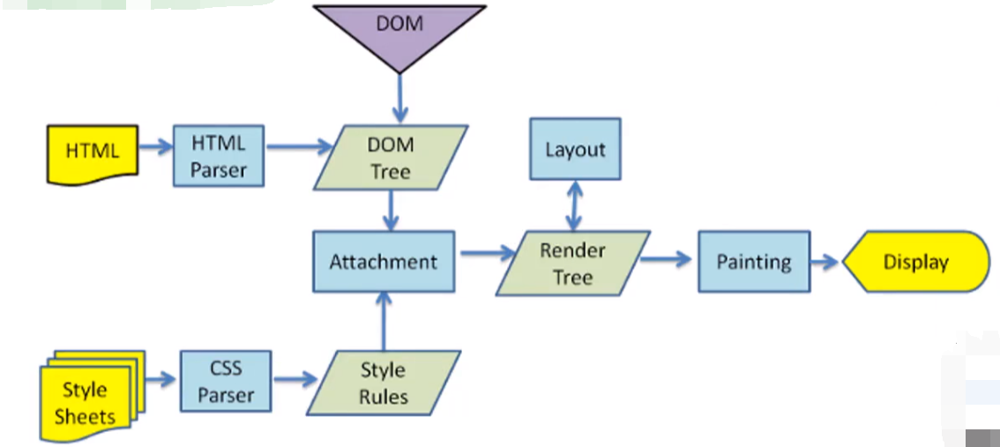
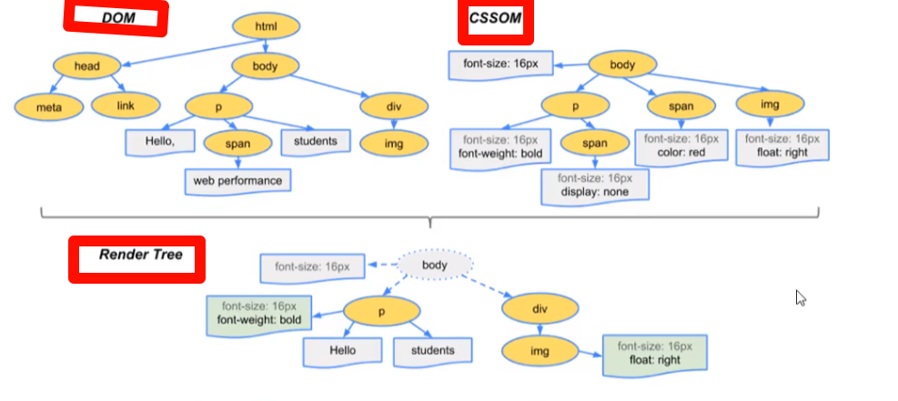
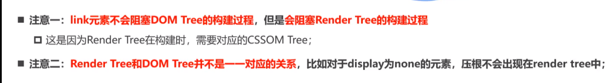

# 1 网页的解析过程
首先再浏览器中输入域名

# 2 浏览器的渲染过程
### 一个网页从开始请求到显示的过程
- （1）在浏览器中输入网址，浏览器解析URL，浏览器检查缓存； 
- （2）发送至DNS服务器并获得域名对应的WEB服务器IP地址，将这IP地址缓存以便下次快速查询； 
- （3）与WEB服务器建立TCP连接，进行三次握手； 
- （4）浏览器向WEB服务器的IP地址发送相应的HTTP请求（请求行，请求头，请求体）； 
- （5）WEB服务器响应请求并返回指定URL的数据，
- （6）浏览器下载数据后解析HTML,css,js源文件，浏览器解析 HTML 代码，按照其结构（标签嵌套关系）在内存中构建一个 DOM 树
-  (7)在解析 HTML 的过程中，如果遇到 `<link>`标签引用外部 CSS 文件或 `<style>` 标签包含内联 CSS：获取这些 CSS 文件，浏览器会解析 CSS 代码，构建一个 **CSSOM (CSS Object Model)**  树。
-  (8)浏览器将 DOM 树和 CSSOM 树结合起来，创建一个 **渲染树 (Render Tree)** 

- (9)布局： 浏览器根据渲染树和视口（Viewport）的大小，计算每个节点在屏幕上的精确位置和尺寸

-   (10)绘制 ： 浏览器遍历渲染树，调用图形库（如 Skia）将每个节点绘制成屏幕上的实际像素。这个过程可能发生在多个图层上

-   (11)合成 ： 浏览器将绘制好的各个图层按照正确的顺序（考虑 z-index 等）合并到一起，最终显示在屏幕上。现代浏览器会利用 GPU 进行合成加速，提高性能。

#### 图片

# 3 回流和重绘解析

# 4 合成和性能优化

# 5 defer和async属性 