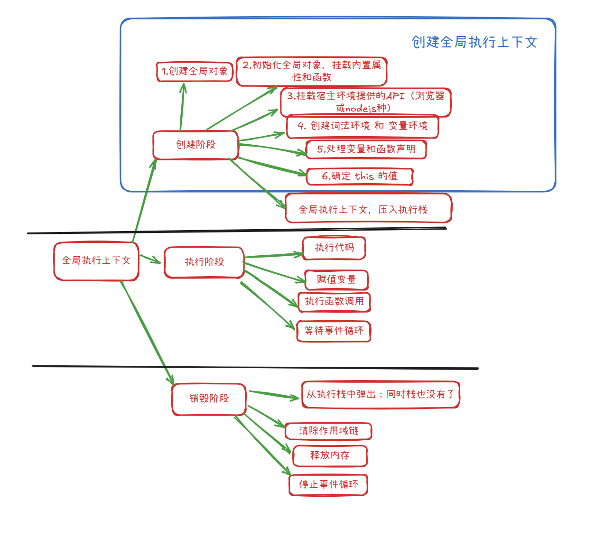
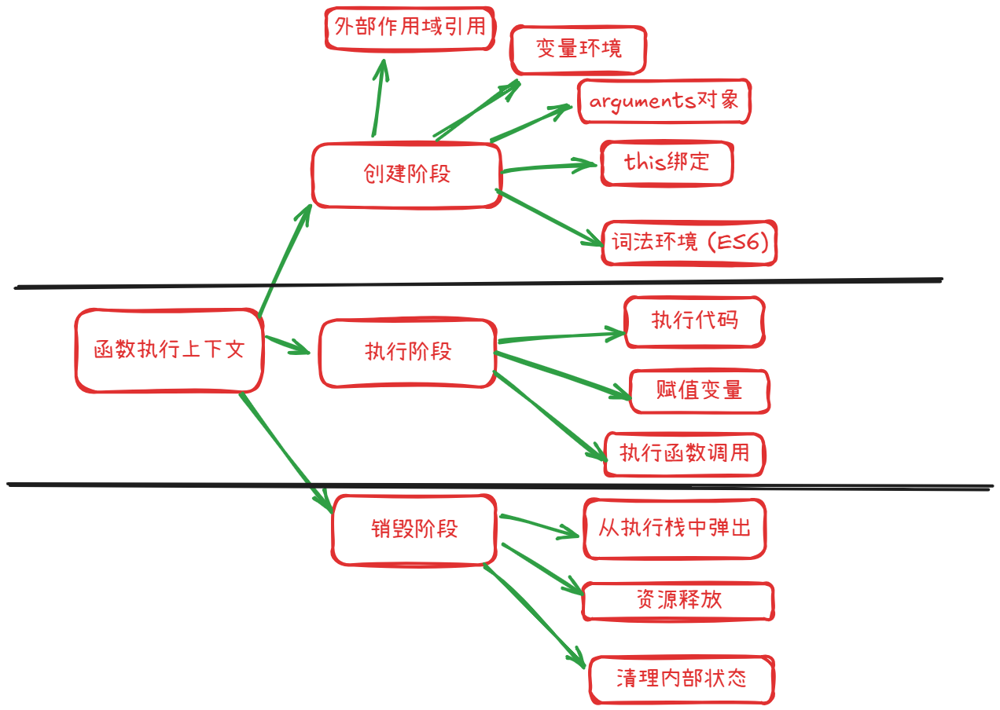

# JavaScript中的执行上下文

#### js中共有3种执行上下文


| 类型              | 描述                           |
| --------------- | ---------------------------- |
| 🔹 全局执行上下文      | 代码一开始默认的上下文（如浏览器中是 `window`） |
| 🔹 函数执行上下文      | 每调用一次函数，就会创建一个新的上下文          |
| 🔹 `eval` 执行上下文 | 极少用，执行 `eval()` 时创建          |


#### 执行上下文的生命周期（3 个阶段）
阶段      | 描述                    |
| ------- | --------------------- |
| 🔹 创建阶段 | 确定作用域、初始化变量对象、绑定 this |
| 🔹 执行阶段 | 代码逐行运行，赋值、调用函数等       |
| 🔹 销毁阶段 | 函数执行完毕，上下文被销毁，内存释放


# 详细的讲解3种执行上下文和对于的三种生命周期

# 1.  **全局执行上下文 (Global Execution Context - GEC)** ：




## 第一阶段---创建阶段--- 初始化全局对象

初始化全局对象是 JavaScript 引擎在开始执行任何脚本代码之前，在**创建全局执行上下文 (Global Execution Context - GEC)** 阶段进行的一个核心步骤。

这个过程可以概括为以下几个方面：

#### 1.  **创建全局对象本身**:

   -   JavaScript 引擎首先会创建一个对象。
   -   在**浏览器环境**中，这个对象通常是 window 对象。
   -   在**Node.js 环境**中，这个对象是 global 对象。
   -   ES2020 引入了 globalThis，提供了一种在不同环境中统一访问全局对象的方式。

#### 2.  **挂载内置对象和函数 (Built-ins)** :

   -   引擎会将所有 ECMAScript 规范定义的内置对象、构造函数和方法作为属性挂载到这个新创建的全局对象上。例如：

       -   Object, Array, String, Number, Boolean, Function
       -   Date, RegExp, Error (及其各种子类如 TypeError, SyntaxError)
       -   Math, JSON
       -   Promise, Symbol, Map, Set, WeakMap, WeakSet
       -   全局函数如 parseInt(), parseFloat(), isNaN(), isFinite(), encodeURI(), decodeURIComponent() 等。

      -   这些内置成员使得我们可以在任何地方直接使用它们，例如直接调用 Array() 或 Math.random()。

#### 3.  **挂载宿主环境提供的对象和函数 (Host Objects)** :

   -   除了 ECMAScript 规范定义的标准内容，宿主环境（如浏览器或 Node.js）也会向全局对象添加其特有的 API。

   -   **浏览器环境**:

       -   DOM API (Document Object Model): document, window.document, Element, NodeList 等。
        -   BOM API (Browser Object Model): navigator, location, history, screen, setTimeout(), setInterval(), alert(), fetch() 等。
       -   事件相关的 API。

   -   **Node.js 环境**:

       -   process 对象 (提供当前 Node.js 进程的信息和控制)
       -   Buffer 类 (用于处理二进制数据)
       -   require() 函数 (用于模块导入)
       -   module, exports (与模块系统相关，虽然 module 和 exports 在模块作用域中更常用，但全局上下文与模块系统的初始化紧密相关)
       -   __dirname, __filename (在模块作用域中可用，指向当前模块的目录和文件名)
       -   全局定时器: setTimeout(), setInterval(), setImmediate() 等。

#### 4.  **创建 this 绑定**:

   -   在全局执行上下文中，this 关键字会被绑定到这个全局对象。
   -   所以在非严格模式下的全局作用域中，this 指向 window (浏览器) 或 global (Node.js)。
   -   在严格模式 ('use strict') 下，全局作用域中的 this 是 undefined。然而，全局对象本身仍然会被创建和初始化。

#### 5.  **（针对用户代码）处理变量和函数声明 (Hoisting)** :

   -   虽然这是全局执行上下文创建阶段的一部分，并且会影响全局对象，但它更多地是针对用户在全局作用域中编写的代码。

   -   **函数声明 (Function Declarations)** : 整个函数定义会被提升，并且函数名会成为全局对象的属性，其值为该函数。

        ```js
        function sayHello() { console.log("Hello"); }
        // 在GEC创建阶段，sayHello 成为 window.sayHello (浏览器)
            
        ```

   -   **var 声明的变量 (Variable Declarations)** : 只有声明会被提升，变量名会成为全局对象的属性，并被初始化为 undefined。实际的赋值操作会在代码执行阶段进行。


   -   **let 和 const 声明的变量**: 它们也会被提升（在概念上），但它们不会成为全局对象的属性。它们存在于全局作用域的词法环境中，并且在声明之前访问会进入“暂时性死区 (TDZ)”导致错误。

**总结初始化全局对象的过程：**

1.  **引擎启动**，准备执行 JavaScript 代码。

1.  **创建全局执行上下文 (GEC)** 。

1.  在 GEC 的**创建阶段**:

    -   **创建全局对象** (window 或 global)。
    -   **将所有内置的 ECMAScript 对象和函数挂载到全局对象上**。
    -   **将宿主环境提供的 API 挂载到全局对象上**。
    -   **设置全局上下文中的 this 指向全局对象** (非严格模式)。
    -   （扫描用户代码）**将全局 var 声明的变量和函数声明添加到全局对象的属性中**（let/const 不会）。

1.  GEC 创建完毕，压入执行栈。

1.  进入 GEC 的**执行阶段**，开始逐行执行全局代码。


## 第二阶段---执行阶段---执行全局代码


全局执行上下文 (Global Execution Context - GEC) 的**执行阶段**是在其创建阶段完成之后立即开始的。在创建阶段，JavaScript 引擎已经设置好了全局环境，包括创建了全局对象、处理了变量和函数声明（提升）以及确定了 this 的指向。

现在，在执行阶段，引擎会按照代码的书写顺序，逐行解释并执行全局作用域下的实际代码。以下是全局执行上下文执行阶段主要做的事情：

### 1.  **变量赋值 (Variable Assignments)** ：

   -   对于在创建阶段通过 var 声明并初始化为 undefined 的变量，如果代码中有赋值语句，此时会执行赋值操作。

       ```js
        // 创建阶段: window.myVar = undefined;
        var myVar = "Hello"; // 执行阶段: window.myVar 被赋值为 "Hello"
            
       ```

   -   对于通过 let 和 const 声明的变量，当执行到其声明和赋值语句时，它们会被赋予相应的值。如果尝试在 let 或 const 声明之前访问它们，会因为暂时性死区 (TDZ) 而抛出错误。

       ```js
        // 创建阶段: globalLet 在词法环境中被记录，但处于 TDZ
        // console.log(globalLet); // 若在此处访问，会抛出 ReferenceError

        let globalLet = "World"; // 执行阶段: globalLet 被赋值为 "World", TDZ 结束
        const PI = 3.14;         // 执行阶段: PI 被赋值为 3.14, TDZ 结束
        // PI = 3; // 若尝试修改 const 变量，会抛出 TypeError
            
       ```

### 2.  **执行函数调用 (Function Calls)** ：

   -   当遇到函数调用语句时，JavaScript 引擎会：

       -   暂停当前全局执行上下文的执行。
       -   创建一个新的**函数执行上下文 (Function Execution Context - FEC)** 。
       -   将这个新的 FEC 压入执行栈的顶部，使其成为当前活动的执行上下文。
       -   然后开始执行该函数内部的代码（这又会经历 FEC 的创建阶段和执行阶段）。
       -   当函数执行完毕后，其 FEC 会从执行栈中弹出，控制权交还给全局执行上下文，并从函数调用的下一行继续执行。

       ```js
        function greet() {
            console.log("Hello from function!");
        }
        console.log("Before function call");
        greet(); // 执行阶段: 调用 greet, 创建 greet FEC, 执行 greet, greet FEC 销毁
        console.log("After function call");
       ```


### 3.  **执行其他语句和表达式 (Execution of other statements and expressions)** ：

   -   引擎会执行所有其他的 JavaScript 语句，例如：

       -   条件语句 (if, else if, else, switch)
       -   循环语句 (for, while, do...while, for...in, for...of)
       -   表达式计算 (算术运算、逻辑运算、比较运算等)
       -   对象创建和属性访问/修改
       -   调用内置函数或宿主环境提供的 API (console.log(), document.getElementById(), setTimeout(), etc.)

### 4.  **处理代码块 (Blocks)** ：

   -   虽然全局作用域本身不是一个典型的“块”，但 ES6 引入了块级作用域（由 {} 包裹），主要与 let 和 const 相关。
   -   当执行流进入一个块时，会为该块创建一个新的词法环境（作为当前执行上下文词法环境的子环境）。let 和 const 声明的变量会存在于这个块级词法环境中。
   -   当执行流离开该块时，这个块级词法环境通常会被销毁（除非有闭包引用其中的变量）。

   ```js
    var x = 1;
    if (true) {
        var x = 2; // 这个 x 仍然是全局的 x，因为 var 没有块级作用域
        let y = 3; // y 是块级作用域变量
        console.log(y); // 输出 3
    }
    console.log(x); // 输出 2
    // console.log(y); // ReferenceError: y is not defined (y 不在外部作用域)
        
   ```


### 5.  **等待异步操作 (Handling Asynchronous Operations)** ：

   -   如果全局代码中启动了异步操作（例如 setTimeout, fetch 请求，事件监听器），这些操作通常不会阻塞主线程的执行。
   -   引擎会注册这些异步任务，然后继续执行后续的同步代码。
   -   当异步任务完成时，其回调函数会被放入任务队列（Callback Queue 或 Macrotask Queue）。事件循环 (Event Loop) 会在执行栈为空时，从任务队列中取出回调函数并执行（这会创建新的函数执行上下文）。


**总结来说，全局执行上下文的执行阶段就是实际“运行”你在全局作用域中编写的代码的过程：**

-   **给变量赋具体的值。**
-   **遇到函数调用就创建新的函数执行上下文并执行函数。**
-   **根据逻辑控制语句决定执行路径。**
-   **与宿主环境交互（例如操作 DOM，发送网络请求）。**
-   **启动异步任务，但不等待它们完成，继续执行同步代码。**

这个阶段会一直持续，直到全局作用域中的所有同步代码都执行完毕。之后，如果 JavaScript 引擎（如浏览器环境或 Node.js）没有关闭，它会进入事件循环，等待并处理异步任务的回调。当所有任务完成且没有更多事件需要处理时，整个 JavaScript 应用程序的生命周期才算结束。

## 第三阶段---销毁阶段---js执行完毕

### ✅ 一、全局执行上下文的生命周期特点

-   **它是整个页面 JS 执行的基础环境**
-   **从页面加载起就创建，直到页面关闭或刷新才销毁**
-   所以：**全局执行上下文的销毁 ≈ 页面的卸载（刷新/关闭）**

* * *

### 🗑 二、销毁阶段的主要任务

当页面关闭或刷新时，全局执行上下文会被销毁，其过程包括：

* * *

#### 1. 💥 **销毁变量对象和函数对象**

-   清除全局变量（`var`）和函数声明
-   如：

```js
var a = 1;
function foo() {}
```

变量 `a` 和函数 `foo` 所占的内存都会被释放

* * *

#### 2. ❌ **清除作用域链**

-   全局词法环境（Lexical Environment）也会被清空，作用域链断开

* * *

#### 3. 🔚 **释放内存和资源**

-   清除所有全局作用域中分配的资源（如 DOM 引用、事件处理器等）
-   启动垃圾回收机制（GC），释放内存空间

* * *

#### 4. 🧼 **终结事件循环**

-   全局上下文的销毁意味着 JS 执行环境终止，事件循环也停止运行

* * *

## 🧠 举个例子：

你打开一个页面，运行如下代码：

```js
var msg = "hello";

function greet() {
  console.log(msg);
}

greet();
```

-   只要页面还开着，这些变量和函数都在内存中

-   当你刷新或关闭页面时，全局执行上下文被销毁：

    -   `msg` 被清除
    -   `greet` 被清除
    -   所有相关内存被释放

* * *

## 📌 小结：全局执行上下文销毁阶段做了什么？

| 步骤          | 内容             |
| ----------- | -------------- |
| 🗑️ 销毁变量和函数 | 清除全局变量、函数声明    |
| ❌ 清除作用域链    | 销毁词法环境及引用关系    |
| 💾 释放内存     | 清除资源、DOM、事件监听器 |
| ⏹️ 停止事件循环   | JS 执行环境终止      |

* * *


# 2.  **函数执行上下文 (Function Execution Context - FEC)** ：



## 第一阶段---创建阶段
### 1. 🔗 **作用域链（Scope Chain） / 外部引用**

-   保存定义该函数时的词法作用域引用（即它“能访问哪些变量”）
-   用于构建**作用域链**，查找变量时逐级向上查找

* * *

### 2. 🗃️ **变量环境（Variable Environment）**

-   初始化 `var` 声明的变量为 `undefined`
-   注册函数内部定义的函数（函数声明会被提升）
-   包含函数的参数（参数名绑定对应传入的值）

例如：

```js
function test(a, b) {
  var x = 10;
}
test(1, 2);
```

变量环境初始为：

```js
{
  a: 1,
  b: 2,
  x: undefined, // 等待执行阶段赋值为 10
}
```

* * *

### 3. 🧠 **词法环境（Lexical Environment）** （ES6 引入）

-   类似变量环境，但用于处理 `let` / `const`
-   也保存着作用域链信息
-   块级作用域也会创建一个新的词法环境

* * *

### 4. 🔑 **`this` 绑定**

-   创建阶段会确定 `this` 的指向：

    -   默认是 `window`（非严格模式）
    -   `undefined`（严格模式）
    -   对象调用：`this` 指向调用者对象
    -   `call` / `apply`：`this` 指向指定对象
    -   箭头函数：不绑定 `this`，从外层继承

* * *

### 5. 📦 **`arguments` 对象**

-   类数组对象，包含所有实参
-   与参数一一对应（非严格模式下参数变化会影响 arguments）
-   在严格模式中 `arguments` 不再与命名参数双向绑定

* * *

## ✅ 小结：创建函数执行上下文时的内容

| 项目                | 说明                       |
| ----------------- | ------------------------ |
| 🔗 外部作用域引用        | 用于构建作用域链，查找变量            |
| 🗃️ 变量环境          | 存储变量和函数声明                |
| 📦 `arguments` 对象 | 存储所有实参                   |
| 🔑 `this` 绑定      | 根据调用方式确定                 |
| 🧠 词法环境（ES6）      | 存储 `let`、`const`，支持块级作用域 |

* * *
## 第二阶段---执行阶段


### 1. ✅ **执行代码**

-   逐行解释并执行函数体内的 JavaScript 代码（自上而下）
-   包括变量赋值、表达式计算、语句控制（if、for）、函数调用等

### 2. 🧠 **变量赋值**

-   对在创建阶段已声明的变量进行初始化赋值
-   示例：

```js
function foo() {
  var a = 10; // 执行阶段：a 被赋值为 10
}
```

> 在创建阶段，`var a` 是 `undefined`，执行阶段才变为 `10`

### 3. 📞 **执行函数调用**

-   如果函数体内还有其他函数调用（嵌套调用），会创建新的函数执行上下文压入执行栈中
-   每个被调用的函数也会经历“创建 → 执行”过程

* * *

## 🧱 执行阶段与创建阶段对比总结

| 阶段       | 作用                           |
| -------- | ---------------------------- |
| 创建阶段     | 建立作用域链，确定 `this`，变量和函数声明（提升） |
| **执行阶段** | 真正执行代码，进行赋值、调用、计算、控制流程       |

* * *

## 🎯 示例完整流程：

```js
function test(x) {
  var y = 10;
  var z = x + y;
  console.log(z);
}
test(5);
```

### 创建阶段（执行上下文创建时）：

-   `x = 5`
-   `y = undefined`
-   `z = undefined`
-   创建 `arguments`
-   确定作用域链、this

### 执行阶段：

-   `y = 10`
-   `z = x + y = 15`
-   `console.log(z)` 输出 15

* * *

# 3.  **Eval 函数执行上下文 (Eval Function Execution Context)** ：

  -   知道即可


# 案例

通过一段具体的 JavaScript 代码示例，详细追踪其从初始化到执行完毕的整个过程，重点关注全局对象的初始化以及执行上下文的创建、执行和销毁。

**示例代码 (example.js):**

```js
// 1. 全局作用域开始
console.log("Script starting..."); // (A)

var globalVar = "I am global"; // (B)
let globalLet = "I am also global (let)"; // (C)

function multiply(a, b) { // (D) 函数声明
    // 3. multiply 函数作用域
    console.log("Inside multiply function"); // (I)
    var result = a * b; // (J)
    console.log("this in multiply (default call):", this === window); // (K) (假设在浏览器环境)
    return result; // (L)
}

function calculate(num1, num2) { // (E) 函数声明
    // 2. calculate 函数作用域
    console.log("Inside calculate function"); // (G)
    var sum = num1 + num2; // (H)
    var product = multiply(num1, num2); // (M) 调用 multiply
    console.log("Sum:", sum); // (N)
    console.log("Product:", product); // (O)
    return sum + product; // (P)
}

console.log("About to call calculate..."); // (F)
var finalResult = calculate(5, 3); // (Q) 调用 calculate
console.log("Final result:", finalResult); // (R)

console.log("Script ended."); // (S)
// 全局作用域结束
    
```

**执行过程详解：**

**阶段 0: JavaScript 引擎准备**

1.  JavaScript 引擎（如 V8）启动，准备解析和执行 example.js。

**阶段 1: 全局执行上下文 (GEC) - 创建阶段**

当引擎开始执行 example.js 时，它首先会创建一个全局执行上下文 (GEC)。

1.  **创建全局对象 (Global Object)** :

    -   在浏览器环境中，引擎创建一个 window 对象。

    -   在 Node.js 环境中，引擎创建一个 global 对象。

    -   **初始化全局对象**:

        -   挂载 ECMAScript 内置对象和函数: Object, Array, String, Number, Boolean, Function, Date, RegExp, Error, Math, JSON, Promise, Symbol, parseInt, isNaN, etc. 这些都成为全局对象的属性。

        -   挂载宿主环境提供的 API:

            -   浏览器: document, navigator, location, setTimeout, console, alert, DOM API 等。
            -   Node.js: process, Buffer, require, module, exports, __dirname, __filename, setTimeout, console 等。

1.  **创建词法环境 (Lexical Environment) 和变量环境 (Variable Environment) for GEC**:

    -   **扫描代码以查找变量和函数声明 (Hoisting)** :

        -   **var globalVar;** : globalVar 被声明并添加到 GEC 的变量环境的环境记录器中，初始值为 undefined。它也会成为全局对象的属性（window.globalVar = undefined）。
        -   **let globalLet;** : globalLet 被声明并添加到 GEC 的词法环境的环境记录器中。它**不会**成为全局对象的属性。此时 globalLet 处于“暂时性死区 (TDZ)”开始的状态。
        -   **function multiply(a, b) { ... }** : 函数声明 multiply 被完整地创建并添加到 GEC 的变量环境的环境记录器中。它也成为全局对象的属性（window.multiply = <function_object>）。
        -   **function calculate(num1, num2) { ... }** : 函数声明 calculate 被完整地创建并添加到 GEC 的变量环境的环境记录器中。它也成为全局对象的属性（window.calculate = <function_object>）。
        -   **var finalResult;** : finalResult 被声明并添加到 GEC 的变量环境的环境记录器中，初始值为 undefined。它也会成为全局对象的属性（window.finalResult = undefined）。

1.  **确定 this 绑定**:

    -   在 GEC 中，this 指向全局对象（在浏览器中是 window，非严格模式下）。

1.  **将 GEC 压入执行栈 (Execution Stack / Call Stack)** :

    -   Execution Stack: [GEC]

**阶段 2: 全局执行上下文 (GEC) - 执行阶段**

引擎开始逐行执行 GEC 中的代码：

1.  **(A) console.log("Script starting...");**

    -   查找 console (在全局对象上找到)，调用其 log 方法。
    -   输出: Script starting...

1.  **(B) globalVar = "I am global";**

    -   赋值操作。GEC 变量环境中的 globalVar (以及 window.globalVar) 的值从 undefined 更新为 "I am global"。

1.  **(C) globalLet = "I am also global (let)";**

    -   赋值操作。globalLet 的暂时性死区结束。GEC 词法环境中的 globalLet 的值被设置为 "I am also global (let)"。

1.  **(D) function multiply(a, b) { ... }**

    -   函数声明在创建阶段已经处理完毕。执行阶段跳过。

1.  **(E) function calculate(num1, num2) { ... }**

    -   函数声明在创建阶段已经处理完毕。执行阶段跳过。

1.  **(F) console.log("About to call calculate...");**

    -   输出: About to call calculate...

1.  **(Q) 遇到 calculate(5, 3);**

    -   这是一个函数调用。引擎会暂停 GEC 的执行，并开始为 calculate 函数创建一个新的函数执行上下文 (FEC)。

**阶段 3: calculate 函数执行上下文 (FEC) - 创建阶段**

1.  **创建 calculate 的 FEC**。

1.  **创建词法环境和变量环境 for calculate FEC**:

    -   **arguments 对象**: 创建一个 arguments 对象：{ 0: 5, 1: 3, length: 2, callee: <calculate_function_object>, Symbol(Symbol.iterator): ƒ }。

    -   **参数绑定**:

        -   num1 被创建并赋值为 5。
        -   num2 被创建并赋值为 3。

    -   **扫描函数内部的变量和函数声明 (Hoisting)** :

        -   var sum;: sum 被声明在 calculate FEC 的变量环境中，初始值为 undefined。
        -   var product;: product 被声明在 calculate FEC 的变量环境中，初始值为 undefined。

1.  **确定 this 绑定**:

    -   calculate 是作为普通函数直接调用的（calculate(5,3) 而不是 obj.calculate(5,3)）。
    -   在非严格模式下，this 指向全局对象 (window)。
    -   在严格模式下，this 会是 undefined。 (本例中我们假设非严格模式)

1.  **设置外部环境引用 (Outer Environment Reference)** :

    -   calculate FEC 的外部环境引用指向 GEC 的词法环境。这形成了作用域链的一部分。

1.  **将 calculate FEC 压入执行栈**:

    -   Execution Stack: [calculate FEC, GEC] (calculate FEC 在栈顶)

**阶段 4: calculate 函数执行上下文 (FEC) - 执行阶段**

引擎开始执行 calculate 函数体内的代码：

1.  **(G) console.log("Inside calculate function");**

    -   输出: Inside calculate function

1.  **(H) var sum = num1 + num2;**

    -   num1 (5) 和 num2 (3) 从 calculate FEC 的环境中获取。
    -   sum 被赋值为 8。

1.  **(M) 遇到 multiply(num1, num2); (即 multiply(5, 3))**

    -   这是一个函数调用。引擎会暂停 calculate FEC 的执行，并开始为 multiply 函数创建一个新的函数执行上下文。

**阶段 5: multiply 函数执行上下文 (FEC) - 创建阶段**

1.  **创建 multiply 的 FEC**。

1.  **创建词法环境和变量环境 for multiply FEC**:

    -   **arguments 对象**: 创建一个 arguments 对象：{ 0: 5, 1: 3, length: 2, ... }。

    -   **参数绑定**:

        -   a 被创建并赋值为 5。
        -   b 被创建并赋值为 3。

    -   **扫描函数内部的变量和函数声明 (Hoisting)** :

        -   var result;: result 被声明在 multiply FEC 的变量环境中，初始值为 undefined。

1.  **确定 this 绑定**:

    -   multiply 也是作为普通函数直接调用的。
    -   在非严格模式下，this 指向全局对象 (window)。

1.  **设置外部环境引用 (Outer Environment Reference)** :

    -   multiply FEC 的外部环境引用指向 GEC 的词法环境 (因为 multiply 是在全局作用域定义的)。

1.  **将 multiply FEC 压入执行栈**:

    -   Execution Stack:` [multiply FEC, calculate FEC, GEC]` (multiply FEC 在栈顶)

**阶段 6: multiply 函数执行上下文 (FEC) - 执行阶段**

引擎开始执行 multiply 函数体内的代码：

1.  **(I) console.log("Inside multiply function");**

    -   输出: Inside multiply function

1.  **(J) var result = a * b;**

    -   a (5) 和 b (3) 从 multiply FEC 的环境中获取。
    -   result 被赋值为 15。

1.  **(K) console.log("this in multiply (default call):", this === window);**

    -   this (指向 window) 与 window 比较。
    -   输出: this in multiply (default call): true

1.  **(L) return result;**

    -   multiply 函数返回 15。

**阶段 7: multiply 函数执行上下文 (FEC) - 销毁阶段**

1.  multiply 函数执行完毕。

1.  multiply FEC 从执行栈中弹出。

    -   Execution Stack: `[calculate FEC, GEC]`

1.  multiply FEC 中的所有局部变量 (result, a, b, arguments) 通常会被垃圾回收机制处理（如果它们不再被任何地方引用）。

1.  控制权返回给 calculate FEC，返回值 15 被传递回去。

**阶段 8: calculate 函数执行上下文 (FEC) - 执行阶段 (继续)**

1.  **(M) var product = multiply(num1, num2);**

    -   product 被赋值为 multiply 函数的返回值，即 15。

1.  **(N) console.log("Sum:", sum);**

    -   sum (8) 从 calculate FEC 的环境中获取。
    -   输出: Sum: 8

1.  **(O) console.log("Product:", product);**

    -   product (15) 从 calculate FEC 的环境中获取。
    -   输出: Product: 15

1.  **(P) return sum + product;**

    -   calculate 函数返回 8 + 15 = 23。

**阶段 9: calculate 函数执行上下文 (FEC) - 销毁阶段**

1.  calculate 函数执行完毕。

1.  calculate FEC 从执行栈中弹出。

    -   Execution Stack: `[GEC]`

1.  calculate FEC 中的所有局部变量 (sum, product, num1, num2, arguments) 通常会被垃圾回收机制处理。

1.  控制权返回给 GEC，返回值 23 被传递回去。

**阶段 10: 全局执行上下文 (GEC) - 执行阶段 (继续)**

1.  **(Q) var finalResult = calculate(5, 3);**

    -   finalResult (以及 window.finalResult) 被赋值为 calculate 函数的返回值，即 23。

1.  **(R) console.log("Final result:", finalResult);**

    -   finalResult (23) 从 GEC 的环境中获取。
    -   输出: Final result: 23

1.  **(S) console.log("Script ended.");**

    -   输出: Script ended.

**阶段 11: 全局执行上下文 (GEC) - 销毁阶段**

1.  example.js 文件中的所有代码已执行完毕。

1.  GEC 从执行栈中弹出。

    -   Execution Stack: [] (栈空)

1.  JavaScript 引擎可能会进行一些清理工作。如果页面关闭或 Node.js 进程结束，全局对象及其所有属性将被销毁。

**总结输出：**

```js
Script starting...
About to call calculate...
Inside calculate function
Inside multiply function
this in multiply (default call): true
Sum: 8
Product: 15
Final result: 23
Script ended.
```
