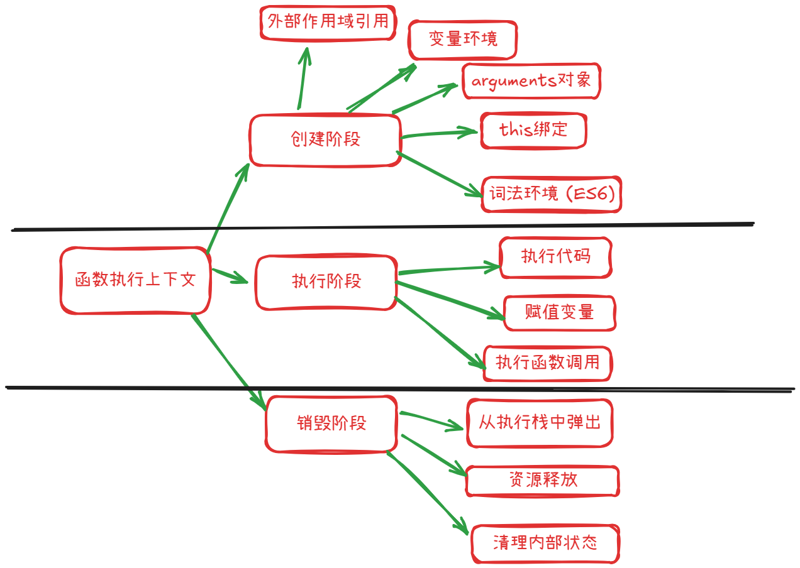

# JavaScript中的执行上下文

#### js中共有3种执行上下文


| 类型              | 描述                           |
| --------------- | ---------------------------- |
| 🔹 全局执行上下文      | 代码一开始默认的上下文（如浏览器中是 `window`） |
| 🔹 函数执行上下文      | 每调用一次函数，就会创建一个新的上下文          |
| 🔹 `eval` 执行上下文 | 极少用，执行 `eval()` 时创建          |


#### 执行上下文的生命周期（3 个阶段）
阶段      | 描述                    |
| ------- | --------------------- |
| 🔹 创建阶段 | 确定作用域、初始化变量对象、绑定 this |
| 🔹 执行阶段 | 代码逐行运行，赋值、调用函数等       |
| 🔹 销毁阶段 | 函数执行完毕，上下文被销毁，内存释放


# 详细的讲解3种执行上下文和对于的三种生命周期

# 1.  **全局执行上下文 (Global Execution Context - GEC)** ：


## 第一阶段---创建阶段--- 初始化全局对象

初始化全局对象是 JavaScript 引擎在开始执行任何脚本代码之前，在**创建全局执行上下文 (Global Execution Context - GEC)** 阶段进行的一个核心步骤。

这个过程可以概括为以下几个方面：

#### 1.  **创建全局对象本身**:

   -   JavaScript 引擎首先会创建一个对象。
   -   在**浏览器环境**中，这个对象通常是 window 对象。
   -   在**Node.js 环境**中，这个对象是 global 对象。
   -   ES2020 引入了 globalThis，提供了一种在不同环境中统一访问全局对象的方式。

#### 2.  **挂载内置对象和函数 (Built-ins)** :

   -   引擎会将所有 ECMAScript 规范定义的内置对象、构造函数和方法作为属性挂载到这个新创建的全局对象上。例如：

       -   Object, Array, String, Number, Boolean, Function
       -   Date, RegExp, Error (及其各种子类如 TypeError, SyntaxError)
       -   Math, JSON
       -   Promise, Symbol, Map, Set, WeakMap, WeakSet
       -   全局函数如 parseInt(), parseFloat(), isNaN(), isFinite(), encodeURI(), decodeURIComponent() 等。

    -   这些内置成员使得我们可以在任何地方直接使用它们，例如直接调用 Array() 或 Math.random()。

#### 3.  **挂载宿主环境提供的对象和函数 (Host Objects)** :

   -   除了 ECMAScript 规范定义的标准内容，宿主环境（如浏览器或 Node.js）也会向全局对象添加其特有的 API。

   -   **浏览器环境**:

       -   DOM API (Document Object Model): document, window.document, Element, NodeList 等。
        -   BOM API (Browser Object Model): navigator, location, history, screen, setTimeout(), setInterval(), alert(), fetch() 等。
       -   事件相关的 API。

   -   **Node.js 环境**:

       -   process 对象 (提供当前 Node.js 进程的信息和控制)
       -   Buffer 类 (用于处理二进制数据)
       -   require() 函数 (用于模块导入)
       -   module, exports (与模块系统相关，虽然 module 和 exports 在模块作用域中更常用，但全局上下文与模块系统的初始化紧密相关)
       -   __dirname, __filename (在模块作用域中可用，指向当前模块的目录和文件名)
       -   全局定时器: setTimeout(), setInterval(), setImmediate() 等。

#### 4.  **创建 this 绑定**:

   -   在全局执行上下文中，this 关键字会被绑定到这个全局对象。
   -   所以在非严格模式下的全局作用域中，this 指向 window (浏览器) 或 global (Node.js)。
   -   在严格模式 ('use strict') 下，全局作用域中的 this 是 undefined。然而，全局对象本身仍然会被创建和初始化。

#### 5.  **（针对用户代码）处理变量和函数声明 (Hoisting)** :

   -   虽然这是全局执行上下文创建阶段的一部分，并且会影响全局对象，但它更多地是针对用户在全局作用域中编写的代码。

   -   **函数声明 (Function Declarations)** : 整个函数定义会被提升，并且函数名会成为全局对象的属性，其值为该函数。

        ```js
        function sayHello() { console.log("Hello"); }
        // 在GEC创建阶段，sayHello 成为 window.sayHello (浏览器)
            
        ```

   -   **var 声明的变量 (Variable Declarations)** : 只有声明会被提升，变量名会成为全局对象的属性，并被初始化为 undefined。实际的赋值操作会在代码执行阶段进行。


   -   **let 和 const 声明的变量**: 它们也会被提升（在概念上），但它们不会成为全局对象的属性。它们存在于全局作用域的词法环境中，并且在声明之前访问会进入“暂时性死区 (TDZ)”导致错误。

**总结初始化全局对象的过程：**

1.  **引擎启动**，准备执行 JavaScript 代码。

1.  **创建全局执行上下文 (GEC)** 。

1.  在 GEC 的**创建阶段**:

    -   **创建全局对象** (window 或 global)。
    -   **将所有内置的 ECMAScript 对象和函数挂载到全局对象上**。
    -   **将宿主环境提供的 API 挂载到全局对象上**。
    -   **设置全局上下文中的 this 指向全局对象** (非严格模式)。
    -   （扫描用户代码）**将全局 var 声明的变量和函数声明添加到全局对象的属性中**（let/const 不会）。

1.  GEC 创建完毕，压入执行栈。

1.  进入 GEC 的**执行阶段**，开始逐行执行全局代码。


# 2.  **函数执行上下文 (Function Execution Context - FEC)** ：



## 第一阶段---创建阶段
### 1. 🔗 **作用域链（Scope Chain） / 外部引用**

-   保存定义该函数时的词法作用域引用（即它“能访问哪些变量”）
-   用于构建**作用域链**，查找变量时逐级向上查找

* * *

### 2. 🗃️ **变量环境（Variable Environment）**

-   初始化 `var` 声明的变量为 `undefined`
-   注册函数内部定义的函数（函数声明会被提升）
-   包含函数的参数（参数名绑定对应传入的值）

例如：

```js
function test(a, b) {
  var x = 10;
}
test(1, 2);
```

变量环境初始为：

```js
{
  a: 1,
  b: 2,
  x: undefined, // 等待执行阶段赋值为 10
}
```

* * *

### 3. 🧠 **词法环境（Lexical Environment）** （ES6 引入）

-   类似变量环境，但用于处理 `let` / `const`
-   也保存着作用域链信息
-   块级作用域也会创建一个新的词法环境

* * *

### 4. 🔑 **`this` 绑定**

-   创建阶段会确定 `this` 的指向：

    -   默认是 `window`（非严格模式）
    -   `undefined`（严格模式）
    -   对象调用：`this` 指向调用者对象
    -   `call` / `apply`：`this` 指向指定对象
    -   箭头函数：不绑定 `this`，从外层继承

* * *

### 5. 📦 **`arguments` 对象**

-   类数组对象，包含所有实参
-   与参数一一对应（非严格模式下参数变化会影响 arguments）
-   在严格模式中 `arguments` 不再与命名参数双向绑定

* * *

## ✅ 小结：创建函数执行上下文时的内容

| 项目                | 说明                       |
| ----------------- | ------------------------ |
| 🔗 外部作用域引用        | 用于构建作用域链，查找变量            |
| 🗃️ 变量环境          | 存储变量和函数声明                |
| 📦 `arguments` 对象 | 存储所有实参                   |
| 🔑 `this` 绑定      | 根据调用方式确定                 |
| 🧠 词法环境（ES6）      | 存储 `let`、`const`，支持块级作用域 |

* * *
## 第二阶段---执行阶段


### 1. ✅ **执行代码**

-   逐行解释并执行函数体内的 JavaScript 代码（自上而下）
-   包括变量赋值、表达式计算、语句控制（if、for）、函数调用等

### 2. 🧠 **变量赋值**

-   对在创建阶段已声明的变量进行初始化赋值
-   示例：

```js
function foo() {
  var a = 10; // 执行阶段：a 被赋值为 10
}
```

> 在创建阶段，`var a` 是 `undefined`，执行阶段才变为 `10`

### 3. 📞 **执行函数调用**

-   如果函数体内还有其他函数调用（嵌套调用），会创建新的函数执行上下文压入执行栈中
-   每个被调用的函数也会经历“创建 → 执行”过程

* * *

## 🧱 执行阶段与创建阶段对比总结

| 阶段       | 作用                           |
| -------- | ---------------------------- |
| 创建阶段     | 建立作用域链，确定 `this`，变量和函数声明（提升） |
| **执行阶段** | 真正执行代码，进行赋值、调用、计算、控制流程       |

* * *

## 🎯 示例完整流程：

```js
function test(x) {
  var y = 10;
  var z = x + y;
  console.log(z);
}
test(5);
```

### 创建阶段（执行上下文创建时）：

-   `x = 5`
-   `y = undefined`
-   `z = undefined`
-   创建 `arguments`
-   确定作用域链、this

### 执行阶段：

-   `y = 10`
-   `z = x + y = 15`
-   `console.log(z)` 输出 15

* * *

# 3.  **Eval 函数执行上下文 (Eval Function Execution Context)** ：

  -   知道即可
