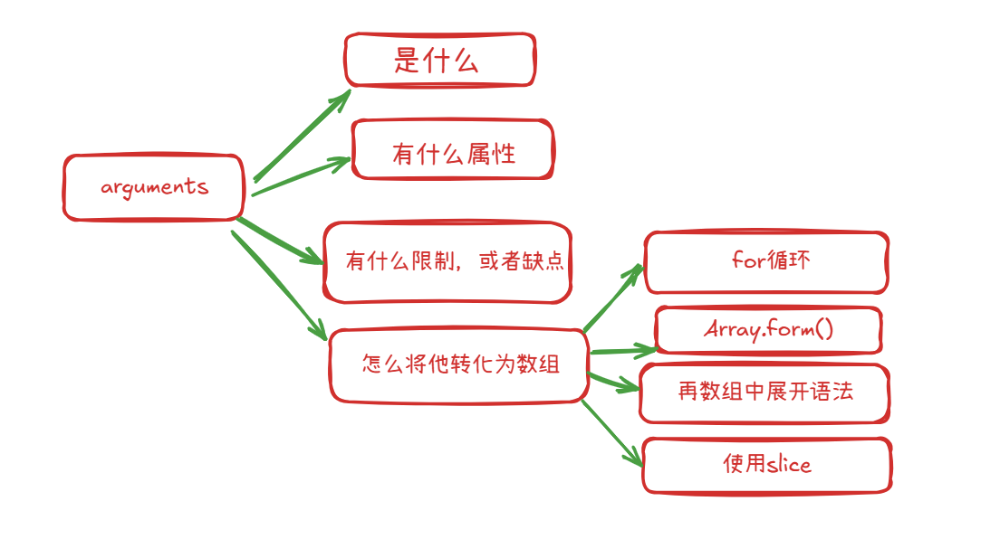
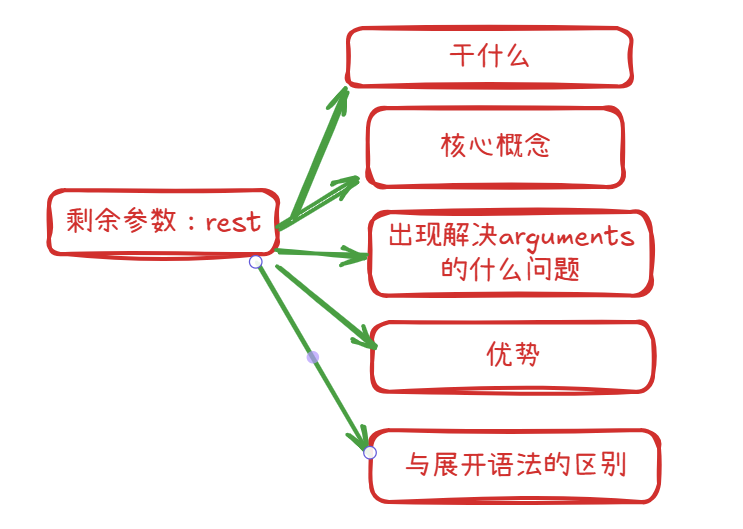
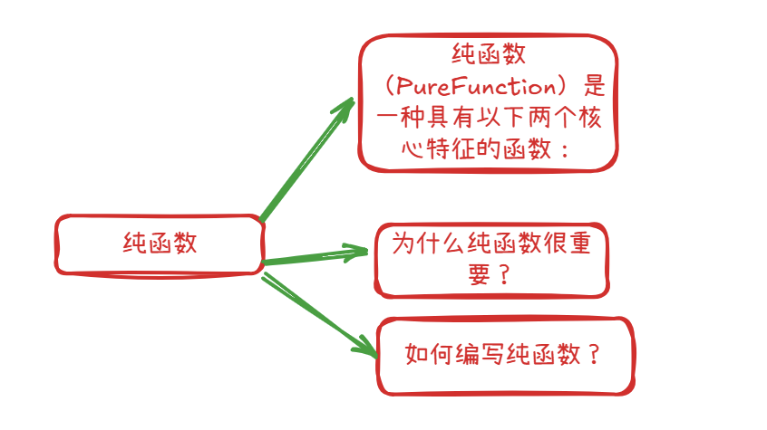
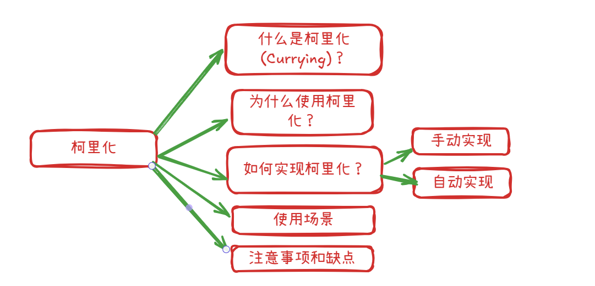
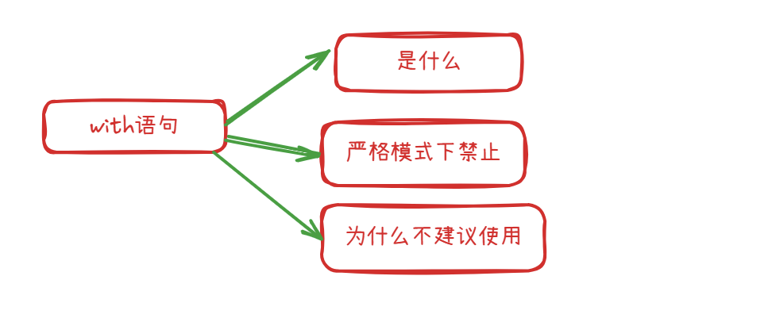
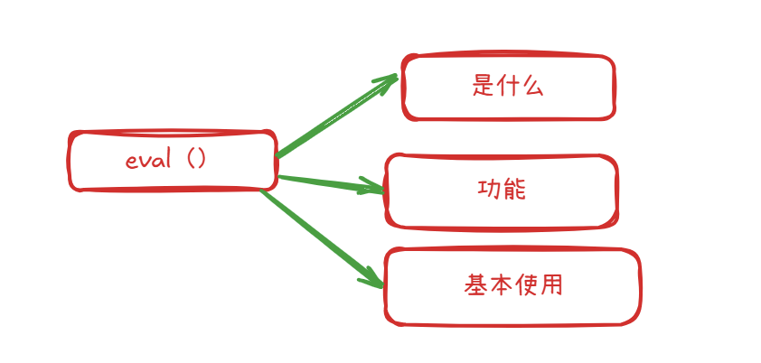

# function 的name属性

```js
//foo 可以看成特殊的对象
function foo() {}
foo.age =22
console.log(foo.age) //22
//foo函数的默认属性有 name：是函数的名字
console.log(foo.name) //foo
```

# function 的length属性

length属性是函数本来要接受的参数的个数
```js
function test(name, age, address) {
  console.log()
}
test('gao', 22, 'shanghai', 'happy')
console.log(test.length)//3
```
特殊情况：
1. 函数中的参数有默认值，length不计算在内
2. `...argument` length不计算在内

# arguments学习



#### 1. 是什么

arguments 是一个在函数内部可用的类数组对象 (array-like object)。它包含了函数被调用时传递给函数的所有参数。

#### 2. 有什么属性

1. 它有 length 属性，表示传入参数的个数。
2. 可以通过索引 (如 arguments[0], arguments[1]) 访问每个参数。
3. 它并不是一个真正的数组。它没有数组原型上的方法，如 forEach(), map(), slice() 等

#### 3. 有什么限制，或缺点

1. 仅在函数内部可用：arguments 对象只在函数执行上下文中存在。
2. 箭头函数没有arguments

#### 4. 怎么将他转化为数组

###### for

```js
function foo(name, age, address) {
  console.log(arguments);
  let newArguments = [];
  for (let args of foo.arguments) {
    newArguments.push(args);
    console.log(newArguments);
  }
  return newArguments;
}
console.log(foo(1, 2, 3, 4, 5));
```

###### Array.form()

```js
function foo(name, age, address) {
  console.log(arguments);
  let newArguments = Array.from(arguments)
  return newArguments;
}
console.log(foo(1, 2, 3, 4, 5));
```

###### 展开语法

```js
function foo(name, age, address) {
  console.log(arguments);
  let newArguments = [...arguments]
  return newArguments;
}
console.log(foo(1, 2, 3, 4, 5));
```

###### slice函数
 了解即可

# 剩余参数




#### 1. 干什么的

剩余参数语法允许我们将一个不定数量的参数表示为一个数组。这使得函数处理可变数量的参数变得更加方便和直观。

#### 2. 核心概念
1.  **语法：**  在函数定义的最后一个参数前面使用三个点 ...。
2.  **行为：**  它会将传递给函数的多余的、没有被形式参数捕获的实际参数收集到一个**真正的数组**中。
3.  **位置：**  剩余参数必须是函数参数列表中的**最后一个参数**。

#### 3. 出现解决了arguments的什么问题

-   **不是真正的数组：**  arguments 是一个类数组对象 (array-like object)，它有 length 属性和索引访问，但没有数组的内置方法（如 map, filter, forEach 等）。你需要通过 Array.prototype.slice.call(arguments) 或 `[...arguments]` (ES6 展开语法) 将其转换为真数组才能使用这些方法。
-   **可读性较差：**  看到 arguments，你并不清楚它具体代表哪些参数。剩余参数命名更清晰。
-   **箭头函数中不可用：**  箭头函数没有自己的 arguments 对象（它会继承外部作用域的 arguments，如果存在的话）。

#### 4. 优势

1.  **真数组：**  收集到的参数是一个真正的数组实例，可以直接使用所有数组方法（map, filter, reduce, forEach, sort 等），无需转换。
2.  **可读性好：**  参数名具有描述性，代码更易理解。
3.  **明确性：**  清楚地表明函数期望接收可变数量的参数，并且这些参数会被收集到哪里。
4.  **部分参数收集：**  可以将前面的参数正常命名，只将“剩余”的参数收集到数组中。arguments 对象总是包含所有传递的参数。
5.  **箭头函数中可用：**  剩余参数在箭头函数中工作得很好。

#### 5. 与展开语法的区别

剩余参数 (Rest Parameters): 在函数定义时使用，将多个独立的参数收集到一个数组中。

展开语法 (Spread Syntax): 在函数调用或数组/对象字面量中使用，将一个数组（或可迭代对象）展开成多个独立的元素/参数，或将一个对象展开到另一个对象中。

# 纯函数



#### 纯函数 (Pure Function) 是一种具有以下两个核心特征的函数

1.  **相同的输入总是返回相同的输出 (Deterministic):**

    -   无论函数被调用多少次，只要传递给它的参数是相同的，它总是返回相同的结果。
    -   它不依赖于任何在函数作用域之外的可变状态（例如全局变量、外部文件的内容、Date.now()、Math.random() 等）。

2.  **没有副作用 (No Side Effects):**

    -   函数在执行过程中不会改变其作用域之外的任何状态。
    -   这意味着它不会修改全局变量、不会修改传入的参数（如果是对象或数组等引用类型，则不应修改其内容）、不会进行 DOM 操作、不会发起 HTTP 请求、不会向控制台打印日志、不会写入文件等。
    -   它唯一的目的就是根据输入计算并返回一个值。


#### **为什么纯函数很重要？**

-   **可预测性 (Predictability):**  由于相同的输入总能得到相同的输出，代码的行为更容易预测和理解。
-   **可测试性 (Testability):**  测试纯函数非常简单。你只需要提供一组输入，然后断言输出是否符合预期，无需担心外部状态或模拟复杂的环境。
-   **可缓存性/记忆化 (Memoization):**  因为纯函数的输出仅取决于其输入，所以可以缓存其结果。如果再次使用相同的参数调用该函数，可以直接返回缓存的结果，从而提高性能。
-   **可组合性 (Composability):**  纯函数更容易组合起来构建更复杂的功能，因为它们之间没有隐式的依赖或副作用。
-   **引用透明性 (Referential Transparency):**  一个纯函数的调用可以用其返回值替换，而不会改变程序的行为。这使得代码更容易推理和重构。
-   **并行处理 (Parallelization):**  纯函数天然适合并行处理，因为它们不会相互干扰或竞争共享资源。

#### **如何编写纯函数？**

1.  **所有依赖都通过参数传入：**  函数不应引用其作用域之外的任何可变变量。

2.  **不修改传入的参数：**  如果参数是对象或数组，创建它们的副本进行操作，而不是直接修改它们。

    -   对于数组，可以使用 slice(), concat(), map(), filter(), reduce() 或扩展运算符 ... 来创建新数组。
    -   对于对象，可以使用 Object.assign({}, obj) 或扩展运算符 {...obj} 来创建新对象。

3.  **不执行任何 I/O 操作：**  例如，不读取或写入文件、不进行网络请求、不操作 DOM。

4.  **返回值仅基于输入参数。**

#### 函数是否为纯函数

```js
// 纯函数：加法
function add(a, b) {
  return a + b;
}

console.log(add(2, 3)); // 总是 5
console.log(add(2, 3)); // 总是 5

// 纯函数：将数组中的每个数字翻倍，并返回一个新数组
function doubleNumbers(numbers) {
  return numbers.map(num => num * 2); // .map() 返回一个新数组，不修改原数组
}

const originalNumbers = [1, 2, 3];
const doubled = doubleNumbers(originalNumbers);
console.log(doubled); // [2, 4, 6]
console.log(originalNumbers); // [1, 2, 3] (原数组未改变)

// 纯函数：获取用户全名
function getFullName(user) {
  return `${user.firstName} ${user.lastName}`;
}
const person = { firstName: 'John', lastName: 'Doe' };
console.log(getFullName(person)); // "John Doe"
```

```js
// 非纯函数：依赖外部状态
let globalCounter = 0;
function incrementGlobalCounter() {
  globalCounter++; // 副作用：修改了外部变量
  return globalCounter; // 输出依赖于 globalCounter 的当前值，不确定
}
console.log(incrementGlobalCounter()); // 1
console.log(incrementGlobalCounter()); // 2 (相同输入，不同输出)

// 非纯函数：有副作用 (修改了传入的参数)
function addItemToArray(arr, item) {
  arr.push(item); // 副作用：修改了传入的数组
  return arr;
}
const myArray = [1, 2];
console.log(addItemToArray(myArray, 3)); // [1, 2, 3]
console.log(myArray); // [1, 2, 3] (原数组被修改)

// 非纯函数：依赖不确定的输入
function getRandomNumber() {
  return Math.random(); // 每次调用返回不同的值
}
console.log(getRandomNumber()); // 比如 0.123
console.log(getRandomNumber()); // 比如 0.456 (相同输入(无)，不同输出)

// 非纯函数：有副作用 (DOM 操作)
function updatePageTitle(newTitle) {
  document.title = newTitle; // 副作用：修改了 DOM
}

// 非纯函数：有副作用 (console.log)
function logMessage(message) {
  console.log(message); // 副作用：向控制台输出
  return message; // 虽然返回了可预测的值，但有副作用
}
```

# 柯里化函数



#### 1. 什么是柯里化

柯里化是一种将接受多个参数的函数转换成一系列只接受单个参数的函数的技术。每次调用这些函数时，它都会返回另一个函数，直到所有参数都提供了，最后才会返回最终的计算结果。

简单来说，柯里化是将一个多元函数（接受多个参数）转变为一元函数（只接受一个参数）的链式调用。

#### 2. 为什么使用柯里化

柯里化有几个重要的优点和应用场景：

1.  **参数复用 (Partial Application - 偏函数应用):**  这是柯里化最常见的用途。你可以通过固定函数的一部分参数来创建一个新的、更具体的函数。

    -   例如，如果你有一个 add(a, b, c) 函数，你可以通过柯里化轻松创建一个 add5 = curriedAdd(5)，这个 add5 函数只需要再接收两个参数 b 和 c 就能完成 5 + b + c 的计算。

2.  **延迟执行 / 惰性求值:**  只有当所有参数都收集完毕后，原始函数才会被执行。这允许你先配置函数，然后在稍后的某个时间点，当所有信息都可用时再执行它。

3.  **提高函数的可组合性:**  柯里化后的函数通常更容易组合和复用，特别是在函数式编程范式中。

4.  **代码更清晰 (有时):**  对于某些特定场景，柯里化可以使代码意图更明确。

#### 3. 如何实现柯里化

###### 手动实现柯里化
```js
function foo(x, y, z) {
  return x + y + z;
}
console.log(foo(1, 2, 3))

function foo(x){
  return function(y) {
    return function(z){
      return x + y + z
    }
  }
}
console.log(foo(1)(2)(3))
```
###### 自动实现柯里化--编写一个实现的函数

#### 使用场景
1. 事件处理器/回调函数:当事件处理器需要额外的参数时，柯里化非常有用
2. 配置化函数:在创建可配置的工具函数时，柯里化很有用。
3. 函数组合 (Function Composition):在函数式编程中，柯里化使得函数组合更加自然。例如，compose(f, g)(x) 相当于 f(g(x))。如果 f 和 g 都是柯里化过的并且只接受一个参数，组合起来会很方便。

#### 注意事项和缺点

-   **可读性:**  对于不熟悉柯里化的开发者来说，一长串的函数调用 fn(a)(b)(c)(d) 可能比 fn(a,b,c,d) 更难理解。
-   **调试:**  调用栈可能会更深，调试时可能需要多注意。
-   **性能:**  每次调用返回一个新函数会有一点点性能开销，但在大多数现代 JavaScript 引擎中，这种开销通常可以忽略不计，除非在性能极其敏感的热点路径上大量使用。
-   **this 指向:**  在使用 apply 或 call 的通用柯里化实现中，this 的指向会被正确传递。但如果手动柯里化时没有妥善处理，可能会遇到 this 指向问题


#  组合函数理解和应用

#### 核心概念

组合函数通常接收两个或多个函数作为参数，并返回一个新的函数。当这个新函数被调用时，它会按照特定的顺序执行传入的那些函数，其中一个函数的输出会作为下一个函数的输入。

#### 为什么使用组合函数？

1.  **可读性 (Readability):**  const processData = compose(formatOutput, calculateResult, parseInput); 比 const processData = (data) => formatOutput(calculateResult(parseInput(data))); 更易读，尤其是当函数链很长时。
2.  **模块化 (Modularity):**  鼓励创建小而专注的函数，每个函数只做一件事。这些小函数更容易测试和理解。
3.  **可重用性 (Reusability):**  这些小函数可以在不同的组合中重复使用。
4.  **声明式风格 (Declarative Style):**  你在描述“做什么”（组合这些操作），而不是“如何做”（显式的嵌套调用）。

#### 最常见的组合方式有两种：

1.  **compose (从右到左执行):**  如果你有 compose(f, g, h)，那么它等价于 (...args) => f(g(h(...args)))。也就是说，h 最先执行，其结果传给 g，g 的结果传给 f。
1.  **pipe (从左到右执行):**  如果你有 pipe(f, g, h)，那么它等价于 (...args) => h(g(f(...args)))。也就是说，f 最先执行，其结果传给 g，g 的结果传给 h。


# 5 with eval 的使用



#### with是什么

它允许你临时将一个对象的属性和方法添加到当前作用域链的顶部，从而在 with 语句块内部可以直接访问这些属性和方法，而无需显式地引用对象本身。

#### 严格模式下禁止

-   "use strict";
-   由于上述问题，ECMAScript 5 的严格模式完全禁止了 with 语句。尝试在严格模式下使用它会导致语法错误 (SyntaxError)。这是一个强烈的信号，表明应该避免使用它。

#### 为什么不建议使用

1.  **性能问题：**

    -   JavaScript 引擎在编译和执行代码时很难优化 with 语句块内部的代码。
    -   当引擎遇到一个变量时，它无法在编译时确定这个变量是 with 语句提供的对象的属性，还是外部作用域中的变量，或者是一个全局变量。
    -   这导致引擎必须在运行时进行动态的作用域查找，这比静态作用域查找要慢得多。

2.  **代码模糊和可读性差：**

    -   当你在 with 语句块内部看到一个变量时，很难立即判断这个变量的来源。它可能来自 with 的对象，也可能来自外部作用域。
    -   这使得代码难以理解、调试和维护。

# eval 的使用



#### 是什么

evaL（）是JavaScript中一个强大但通常不推荐使用的函数。它的主要功能是将一个字符串当作JavaScript代码来执行。

#### 功能

evaL（string）函数会计算或执行作为字符串传递给它的参数。
·如果参数是一个表达式，eval（）会计算该表达式。
·如果参数是 JavaScript 语句，evaL（）会执行这些语句

#### 基本使用

```js
console.log(eval('2 + 2')); // 输出: 4

let x = 10;
let y = 20;
console.log(eval('x + y')); // 输出: 30

eval('var z = 5; console.log(z * 2);'); // 输出: 10
console.log(z); // 输出: 5 (z 在当前作用域被定义了)

let code = 'function greet() { return "Hello!"; } greet();';
console.log(eval(code)); // 输出: "Hello!"
```