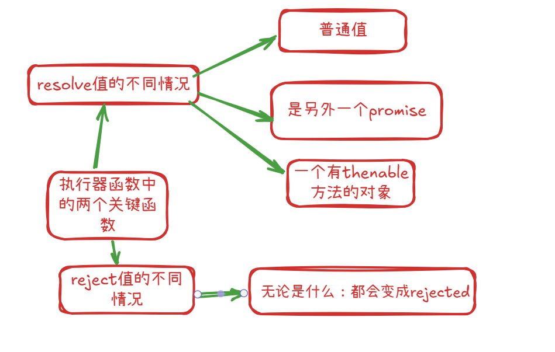
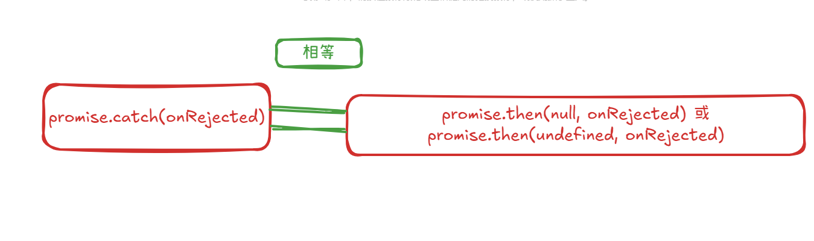

# 1. 异步代码的困境
```js
//main.js
//导出 execCode函数
function execCode(counter, successCallback, failureCallback) {
  setTimeout(() => {
    if (counter > 0) {
      let tatal = 0;
      successCallback(tatal);
    } else {
      failureCallback(`counter 有问题：${counter}`);
    }
  }, 3000);
}
```

```js
//foo.js
//引入 execCode函数
execCode(
  100,
  (value) => {
    console.log(`code running is OK ${value}`);
  },
  (err) => {
    console.log(`code run is FAIL ${err}`);
  }
);
```

# 2. 认识promise的作用

1.  **什么是 Promise？**

    -   Promise 是一个对象，代表一个异步操作的最终完成（或失败）及其结果值。
    -   它充当了异步操作的代理，允许你为异步操作的成功和失败分别绑定相应的处理函数。


# 3. Promise状态变化

Promise 的三种状态：

Pending（进行中）: 初始状态，既不是成功，也不是失败状态。

Fulfilled（已成功/已解决）: 意味着操作成功完成。此时 Promise 有一个值（value）。

Rejected（已失败/已拒绝）: 意味着操作失败。此时 Promise 有一个原因（reason），通常是一个 Error 对象。

状态转换：Promise 的状态一旦从 pending 变为 fulfilled 或 rejected，就不会再改变。这个过程称为 "settled"（已敲定）。

# 4. Promise的基本使用

当new一个Promise中会有一个立即执行函数，函数中执行决定了promise的状态





### resolve(value)

当异步操作成功时，调用 resolve(value) 会将 Promise 的状态从 pending 变为 fulfilled。value 可以是任何合法的 JavaScript 值。

1.  **resolve(普通值) (如字符串、数字、布尔值、对象、数组、null, undefined)**

    -   **Promise 状态**: fulfilled
    -   **Promise 的值**: 就是你传递的那个普通值。
    -   **后续 .then(onFulfilled)** : onFulfilled 回调函数会接收到这个普通值作为参数。

    ```js
    new Promise(resolve => resolve("Hello"))
      .then(val => console.log(val)); // 输出: "Hello"

    new Promise(resolve => resolve(123))
      .then(val => console.log(val)); // 输出: 123

    new Promise(resolve => resolve({ message: "Success" }))
      .then(val => console.log(val.message)); // 输出: "Success"

    new Promise(resolve => resolve(undefined)) // 即使是 undefined，也是一个成功的 resolve
      .then(val => console.log(val)); // 输出: undefined
        
    ```

1.  **resolve(promise) (传递另一个 Promise 对象)**

    -   **Promise 状态**: 当前 Promise (我们称之为 p1) 的状态会**依赖于**你传递的那个 Promise 对象 (我们称之为 p2)。

        -   如果 p2 最终变为 fulfilled，p1 也会变为 fulfilled，并且 p1 的值与 p2 的值相同。
        -   如果 p2 最终变为 rejected，p1 也会变为 rejected，并且 p1 的原因与 p2 的原因相同。
        -   如果 p2 保持 pending，p1 也会保持 pending。

    -   这被称为 "Promise 采纳 (adoption)" 或 "Promise 展开 (flattening)"。resolve 函数会等待 p2 settled。

    -   **后续 .then(onFulfilled) 或 .catch(onRejected)** : 会根据 p2 的最终状态和结果来执行。

    ```js
    const p2_fulfilled = Promise.resolve("Inner promise resolved");
    new Promise(resolve => resolve(p2_fulfilled))
      .then(val => console.log("Resolved with fulfilled promise:", val)); // 输出: Resolved with fulfilled promise: Inner promise resolved

    const p2_rejected = Promise.reject(new Error("Inner promise rejected"));
    new Promise(resolve => resolve(p2_rejected)) // 注意：这里是 resolve(p2_rejected)，而不是 reject(p2_rejected)
      .then(
        val => console.log("This won't run:", val),
        err => console.error("Resolved with rejected promise, so outer rejects:", err.message)
      ); // 输出: Resolved with rejected promise, so outer rejects: Inner promise rejected

    const p2_pending = new Promise(() => {}); // 一个永远 pending 的 Promise
    const p1_pending = new Promise(resolve => resolve(p2_pending));
    p1_pending.then(() => console.log("This will never run because p1 stays pending"));
    // p1_pending 会一直处于 pending 状态
        
    ```


1.  **resolve(thenable) (传递一个拥有 .then 方法的对象，但不是真正的 Promise 实例)**

    -   **Promise 状态**: resolve 函数会尝试将这个 thenable 对象 "展开"。它会调用 thenable.then(resolvePromise, rejectPromise)。

        -   如果 thenable 的 .then 方法最终调用了 resolvePromise(y)，那么当前 Promise 就会以 y 来解决（如果 y 还是 thenable 或 Promise，会继续展开）。
        -   如果 thenable 的 .then 方法最终调用了 rejectPromise(r)，那么当前 Promise 就会以 r 来拒绝。
        -   如果 thenable 的 .then 方法抛出错误，当前 Promise 也会以该错误拒绝。

    -   **后续 .then(onFulfilled) 或 .catch(onRejected)** : 会根据 thenable 展开后的最终状态和结果来执行。

    -   这是为了与遵循 Promises/A+ 规范的其他 Promise 实现兼容。

    ```js
    const thenable = {
      then: function(onFulfilled, onRejected) {
        console.log("Thenable's then method called");
        // 模拟异步
        setTimeout(() => {
          // onFulfilled("Value from thenable");
          onRejected(new Error("Error from thenable"));
        }, 500);
      }
    };

    new Promise(resolve => {
      console.log("Resolving with a thenable...");
      resolve(thenable);
    })
    .then(
      val => console.log("Fulfilled with thenable's value:", val),
      err => console.error("Rejected by thenable's logic:", err.message)
    );
    // 如果 thenable 的 then 调用 onFulfilled: Fulfilled with thenable's value: Value from thenable
    // 如果 thenable 的 then 调用 onRejected: Rejected by thenable's logic: Error from thenable
        
    ```


### reject(reason)

当异步操作失败时，调用 reject(reason) 会将 Promise 的状态从 pending 变为 rejected。reason 描述了失败的原因。

1.  **reject(errorObject) (传递一个 Error 对象或其子类的实例)**

    -   **Promise 状态**: rejected

    -   **Promise 的原因**: 就是你传递的那个 Error 对象。

    -   **后续 .catch(onRejected) 或 .then(null, onRejected)** : onRejected 回调函数会接收到这个 Error 对象作为参数。

    -   **最佳实践**: **强烈推荐** reject 时总是传递一个 Error 对象。这样做的好处是：

        -   Error 对象包含有用的调试信息，如 message、name 和 stack (堆栈跟踪)。
        -   符合 JavaScript 中错误处理的通用模式。
        -   一些工具和库可能期望 reason 是一个 Error 对象。

    ```js
    new Promise((resolve, reject) => reject(new Error("Something went wrong!")))
      .catch(err => {
        console.error("Caught error object:", err);
        console.error("Error message:", err.message); // "Something went wrong!"
        console.error("Error name:", err.name);     // "Error"
        // console.error("Error stack:", err.stack); // 包含调用堆栈信息
      });
    ```


1.  **reject(普通值) (如字符串、数字、null, undefined, 普通对象)**

    -   **Promise 状态**: rejected
    -   **Promise 的原因**: 就是你传递的那个普通值。
    -   **后续 .catch(onRejected) 或 .then(null, onRejected)** : onRejected 回调函数会接收到这个普通值作为参数。
    -   **不推荐**: 虽然技术上可行，但不推荐这样做。如果传递的不是 Error 对象，会丢失堆栈跟踪等有用的调试信息。

    ```js
    new Promise((resolve, reject) => reject("Just a string error"))
      .catch(reason => {
        console.error("Caught string reason:", reason); // "Just a string error"
        // reason.message 和 reason.stack 会是 undefined
      });

    new Promise((resolve, reject) => reject(404))
      .catch(reason => {
        console.error("Caught number reason:", reason); // 404
      });
        
    ```

**总结关键区别和建议：**

-   **resolve(value)** :

    -   如果 value 是普通值，Promise 变为 fulfilled，值为 value。
    -   如果 value 是另一个 Promise，当前 Promise 的状态和结果会跟随那个 Promise。
    -   如果 value 是 thenable，会尝试展开它。

-   **reject(reason)** :

    -   无论 reason 是什么 (Error 对象、普通值)，Promise 都会变为 rejected，原因为 reason。
    -   **强烈建议 reject 时传递一个 Error 对象**，以便更好地进行错误诊断和调试。


# 5. Promise实例方法

共有3种实例方法

方法                               | 说明                                 |
| -------------------------------- | ---------------------------------- |
| `.then(onFulfilled, onRejected)` | 注册成功或失败的回调                         |
| `.catch(onRejected)`             | 捕获错误，相当于 `.then(null, onRejected)` |
| `.finally(onFinally)`            | 不管成功或失败，都会执行（常用于清理）

1. 当promise有相应的实例方法使用时，他们都会执行代码，但是不一定都会起作用

2. then中onFulfilled函数 onRejected函数会return一个新的promise

3. catch的onRejected函数 也会返回一个新的promise



#### 代码案例

这两个代码片段的主要区别在于 .then() 方法的使用方式：

1.  **第一个代码片段：Promise 链式调用 (Chaining)**
1.  **第二个代码片段：对同一个 Promise 注册多个独立的 .then() 回调**

让我们详细分析：

* * *

**第一个代码片段 (链式调用):**

```js
const promise1 = new Promise((resolve, reject) => { // Renamed to avoid redeclaration error
  resolve(99);
});
promise1
  .then( // First .then()
    (successValue) => {
      console.log(`successValue is :${successValue}`); // Logs: successValue is :99
      // 这个回调函数没有显式返回任何东西，所以它隐式返回 undefined
    },
    (errorReason) => {
      console.log(`error :${errorReason}`);
    }
  )
  .then((val) => { // Second .then()
    // 这个 .then() 接收的是上一个 .then() 回调的返回值
    // 因为上一个回调返回 undefined，所以 val 是 undefined
    console.log("val", val); // Logs: val undefined
    // 这个回调也隐式返回 undefined
  })
  .then((val) => { // Third .then()
    // 这个 .then() 接收的是上一个 .then() 回调的返回值
    // 因为上一个回调返回 undefined，所以 val 是 undefined
    console.log("val", val); // Logs: val undefined
  });
    
```

**工作方式：**

-   promise1 被创建并立即 resolve(99)。

-   **第一个 .then()** :

    -   它的成功回调接收到 99，并打印 successValue is :99。

    -   这个成功回调函数没有 return 语句，所以它默认返回 undefined。

    -   重要的是： **.then() 方法本身会返回一个新的 Promise**。这个新的 Promise 的状态和值取决于其回调函数的行为：

        -   如果回调函数返回一个值 (或 undefined)，新的 Promise 会以该值 resolve。
        -   如果回调函数返回一个新的 Promise，则 .then() 返回的 Promise 会采纳这个新的 Promise 的状态。
        -   如果回调函数抛出错误，新的 Promise 会以该错误 reject。

    -   在这里，第一个 .then() 返回的 Promise 会 resolve with undefined。

-   **第二个 .then()** :

    -   它被附加到第一个 .then() 返回的 Promise 上。
    -   因此，它的成功回调接收到的 val 是 undefined（上一个回调的返回值）。
    -   它打印 val undefined。
    -   它也隐式返回 undefined，所以它返回的 Promise 会 resolve with undefined。

-   **第三个 .then()** :

    -   它被附加到第二个 .then() 返回的 Promise 上。
    -   它的成功回调接收到的 val 也是 undefined。
    -   它打印 val undefined。

**输出：**

```js
successValue is :99
val undefined
val undefined
    
```


* * *

**第二个代码片段 (对同一个 Promise 注册多个回调):**

```js
const promise2 = new Promise((resolve, reject)=> { // Renamed to avoid redeclaration error
  resolve(99)
})
promise2.then(successValue=> { // First .then() attached to promise2
  console.log(`successValue is :${successValue}`) // Logs: successValue is :99
},errorReason=>{
  console.log(`error :${errorReason}`)
})
promise2.then((val)=> { // Second .then() attached to promise2
  // 这个回调直接从 promise2 获取值
  console.log('val',val) // Logs: val 99
})
promise2.then((val)=>{ // Third .then() attached to promise2
  // 这个回调也直接从 promise2 获取值
  console.log('val',val) // Logs: val 99
})
    
```


**工作方式：**

-   promise2 被创建并立即 resolve(99)。
-   **所有三个 .then() 方法都是直接在原始的 promise2 对象上调用的。**
-   它们不是链式连接的，而是像扇叶一样，都连接到同一个中心 (promise2)。
-   当 promise2 resolve 时，它会通知所有附加到它的 .then() 的成功回调。
-   **第一个 .then()** : 接收到 99，打印 successValue is :99。
-   **第二个 .then()** : 接收到 99 (来自 promise2，而不是第一个 .then() 的结果)，打印 val 99。
-   **第三个 .then()** : 接收到 99 (来自 promise2)，打印 val 99。

**输出：**

```js
successValue is :99
val 99
val 99
    
```


(注意：这三个 console.log 的确切执行顺序可能因 JavaScript 引擎的微任务队列调度而略有不同，但它们都会在 promise2 resolve 后执行，并且后两个都会接收到 99。)

* * *

**总结差异：**

| 特性              | 第一个代码片段 (链式调用)                                                     | 第二个代码片段 (独立注册)                              |
| --------------- | ------------------------------------------------------------------ | ------------------------------------------- |
| **.then() 的目标** | 每个后续的 .then() 都作用于前一个 .then() 返回的新 Promise。                        | 所有的 .then() 都作用于同一个原始的 Promise。             |
| **回调接收的值**      | 第一个回调接收原始 Promise 的值。后续回调接收前一个回调的返回值。                              | 所有成功回调都接收原始 Promise 的值。                     |
| **数据流**         | 串行：P0 -> then1(out1) -> P1(out1) -> then2(out2) -> P2(out2) -> ... | 并行/独立：P0 -> then1, P0 -> then2, P0 -> then3 |
| **用途**          | 用于需要按顺序执行异步操作，并且后一个操作依赖于前一个操作结果的场景。                                | 用于当一个异步操作完成后，需要触发多个独立的后续操作的场景。              |

理解这个区别对于正确使用 Promise 至关重要。链式调用允许你构建复杂的异步操作序列，而独立注册则允许你对同一个事件做出多个独立的响应。

#### .then() 和 .catch() 方法中回调函数的返回值及其对 Promise 链的影响。

核心概念：  
**.then() 和 .catch() 方法本身总是返回一个新的 Promise。** 这个新的 Promise 的状态（resolved 或 rejected）和值（或原因）取决于你在其回调函数中的操作。

* * *

**1. .then(onFulfilled, onRejected) 的返回值**

.then() 方法可以接受两个回调函数作为参数：

-   onFulfilled: 当 Promise 状态变为 resolved (成功) 时执行。
-   onRejected: 当 Promise 状态变为 rejected (失败) 时执行。

**onFulfilled (成功回调) 的返回值：**

-   **a. 如果 onFulfilled 返回一个普通值 (非 Promise)：**

    -   .then() 返回的新 Promise 将会 **resolved**，并且其 resolved value 就是 onFulfilled 返回的那个值。
    -   如果 onFulfilled 没有显式 return 语句，它会隐式返回 undefined，那么新的 Promise 也会 resolve with undefined。

    ```js
    Promise.resolve(10)
      .then(value => {
        console.log("First then:", value); // First then: 10
        return value * 2; // 返回一个普通值 20
      })
      .then(value => {
        console.log("Second then:", value); // Second then: 20
        // 没有显式 return，隐式返回 undefined
      })
      .then(value => {
        console.log("Third then:", value); // Third then: undefined
      });
        
    ```

-   **b. 如果 onFulfilled 返回一个新的 Promise (我们称之为 innerPromise)：**

    -   .then() 返回的新 Promise (我们称之为 outerPromise) 将会 **采纳 (adopt)** innerPromise 的状态。

        -   如果 innerPromise resolve，outerPromise 也会 resolve，并且其 resolved value 与 innerPromise 相同。
        -   如果 innerPromise reject，outerPromise 也会 reject，并且其 rejection reason 与 innerPromise 相同。

    -   这使得你可以将异步操作链接起来，而不会产生嵌套的 Promise (Promise "扁平化")。

    ```js
    Promise.resolve(5)
      .then(value => {
        console.log("First then:", value); // First then: 5
        return new Promise(resolve => setTimeout(() => resolve(value + 5), 100)); // 返回一个 Promise
      })
      .then(value => {
        // 这个 .then 等待上面的 Promise resolve
        console.log("Second then:", value); // Second then: 10 (5 + 5)
      });
        
    ```


-   **c. 如果 onFulfilled 抛出一个错误：**

    -   .then() 返回的新 Promise 将会 **rejected**，并且其 rejection reason 就是抛出的那个错误。

    ```js
    Promise.resolve("success")
      .then(value => {
        console.log("First then:", value); // First then: success
        throw new Error("Error in onFulfilled!");
      })
      .then(
        value => console.log("This won't run:", value),
        error => console.error("Caught in onRejected:", error.message) // Caught in onRejected: Error in onFulfilled!
      );
        
    ```


**onRejected (失败回调) 的返回值：**

onRejected 的行为与 onFulfilled 非常相似，但关键区别在于它用于**处理错误**。

-   **a. 如果 onRejected 返回一个普通值 (非 Promise)：**

    -   .then() 返回的新 Promise 将会 **resolved** (是的，resolved！)，并且其 resolved value 就是 onRejected 返回的那个值。
    -   这表示错误已经被处理/捕获，并且 Promise 链可以从错误中“恢复”并继续执行成功路径。

    ```js
    Promise.reject(new Error("Initial error"))
      .then(
        null, // 没有 onFulfilled
        reason => {
          console.error("onRejected caught:", reason.message); // onRejected caught: Initial error
          return "Recovered value"; // 返回一个普通值，用于恢复
        }
      )
      .then(value => {
        console.log("Next then after recovery:", value); // Next then after recovery: Recovered value
      });
        
    ```


-   **b. 如果 onRejected 返回一个新的 Promise (innerPromise)：**

    -   .then() 返回的新 Promise (outerPromise) 将会 **采纳** innerPromise 的状态。

        -   如果 innerPromise resolve，outerPromise 也会 resolve (错误被处理，可能通过异步操作恢复)。
        -   如果 innerPromise reject，outerPromise 也会 reject (错误处理失败，或产生了新的错误)。

    ```js
    Promise.reject(new Error("Network failed"))
      .then(null, reason => {
        console.error("Attempting recovery for:", reason.message);
        // 尝试从备用源获取数据
        return new Promise((resolve, reject) => {
          // 假设备用源成功
          setTimeout(() => resolve("Data from fallback"), 100);
          // 假设备用源也失败
          // setTimeout(() => reject(new Error("Fallback also failed")), 100);
        });
      })
      .then(
        value => console.log("Successfully recovered:", value), // Successfully recovered: Data from fallback
        error => console.error("Recovery failed:", error.message)
      );
        
    ```


-   **c. 如果 onRejected 抛出一个错误 (或者重新抛出接收到的错误)：**

    -   .then() 返回的新 Promise 将会 **rejected**，并且其 rejection reason 就是抛出的那个新错误 (或原始错误)。错误会继续向下传播。

    ```js
    Promise.reject(new Error("Initial error"))
      .then(null, reason => {
        console.error("onRejected caught:", reason.message); // onRejected caught: Initial error
        throw new Error("New error from onRejected"); // 抛出新错误
        // 或者: throw reason; // 重新抛出原始错误
      })
      .catch(error => {
        console.error("Caught by .catch():", error.message); // Caught by .catch(): New error from onRejected
      });
        
    ```


* * *

**2. .catch(onRejected) 的返回值**

.catch(onRejected) 实际上是 .then(null, onRejected) 的语法糖。  
因此，其回调函数 onRejected 的返回值行为与上面描述的 .then() 的 onRejected 部分完全相同：

-   **a. 如果 onRejected (在 .catch() 中) 返回一个普通值：**

    -   .catch() 返回的新 Promise 将会 **resolved** (错误被处理)。
    -   后续的 .then() 将接收到这个返回值。

    ```js
    Promise.reject(new Error("Something went wrong"))
      .catch(error => {
        console.error("Caught by .catch():", error.message); // Caught by .catch(): Something went wrong
        return "Default value after error"; // 错误处理，返回一个默认值
      })
      .then(value => {
        console.log("Then after catch:", value); // Then after catch: Default value after error
      });
        
    ```


-   **b. 如果 onRejected (在 .catch() 中) 返回一个新的 Promise (innerPromise)：**

    -   .catch() 返回的新 Promise 将会 **采纳** innerPromise 的状态。

    ```js
    Promise.reject(new Error("Bad request"))
      .catch(error => {
        console.error("Caught:", error.message);
        return new Promise(resolve => setTimeout(() => resolve("Retried and succeeded"), 50));
      })
      .then(value => console.log("Final result:", value)); // Final result: Retried and succeeded
        
    ```


-   **c. 如果 onRejected (在 .catch() 中) 抛出一个错误：**

    -   .catch() 返回的新 Promise 将会 **rejected**。错误会继续向下传播到下一个 .catch()。

    ```js
    Promise.reject(new Error("Initial problem"))
      .catch(error => {
        console.error("First catch:", error.message); // First catch: Initial problem
        throw new Error("Problem during error handling"); // 抛出新错误
      })
      .catch(error => {
        console.error("Second catch:", error.message); // Second catch: Problem during error handling
      });
        
    ```


* * *

**总结与关键点：**

1.  **链式结构：** .then() 和 .catch() 总是返回一个新的 Promise，这使得链式调用成为可能。

1.  **控制流：**

    -   从 onFulfilled 或 onRejected (或 .catch 的回调) 返回一个**普通值**或**不返回** (隐式 undefined)，会导致返回的新 Promise **resolve** (即使是在 onRejected 或 .catch 中，这也意味着错误被“处理”了)。
    -   返回一个**Promise**，会导致返回的新 Promise **采纳**这个内部 Promise 的状态。
    -   **抛出错误**，会导致返回的新 Promise **reject**。

1.  **错误处理与恢复：**

    -   onRejected (在 .then 或 .catch 中) 如果不重新抛出错误，并且返回一个普通值或 resolve 的 Promise，那么 Promise 链就从错误状态中恢复，后续的 .then 会被执行。
    -   如果 onRejected 抛出错误或返回一个 rejected 的 Promise，错误会继续传播。


#### 6. Promise的类方法

方法                                  | 说明                               |
| ----------------------------------- | -------------------------------- |
| `Promise.resolve(value)`            | 返回一个成功状态的 Promise（已解决）           |
| `Promise.reject(reason)`            | 返回一个失败状态的 Promise（已拒绝）           |
| `Promise.all([p1, p2, ...])`        | 所有 Promise 都成功，才成功；有一个失败就失败      |
| `Promise.allSettled([p1, p2, ...])` | 等待所有 Promise 都完成（无论成功或失败），返回每个结果 |
| `Promise.race([p1, p2, ...])`       | 谁先结束（成功或失败）就返回谁的结果               |
| `Promise.any([p1, p2, ...])`        | 有一个成功就成功；全部失败才失败（ES2021）

