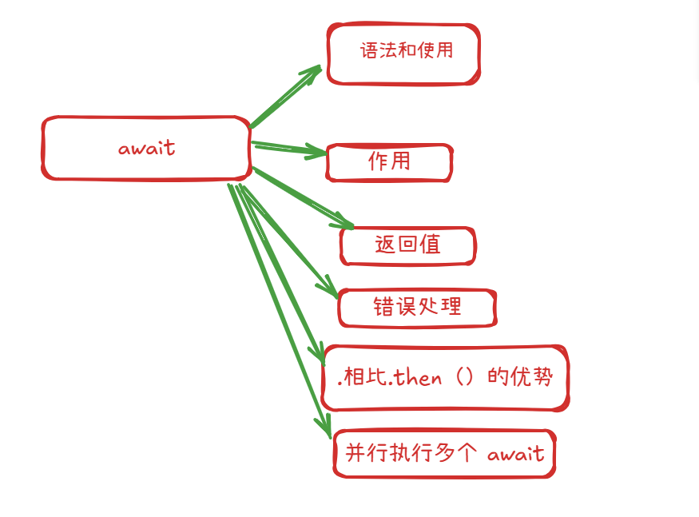
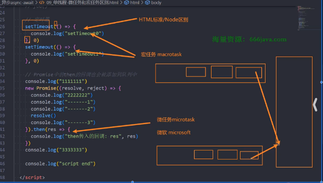
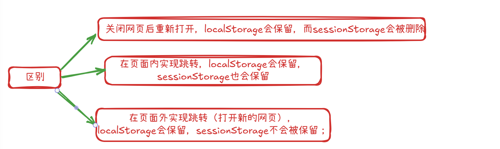

# async await

#### 基本使用


###### 基本概念

1.  **async 关键字**:

    -   当你用 async 关键字声明一个函数时，这个函数会自动返回一个 Promise 对象。
    -   即使函数内部没有显式返回一个 Promise，或者只是返回一个普通值（如数字、字符串），async 函数也会将这个返回值包装在一个已解决（resolved）的 Promise 中。
    -   如果函数内部抛出一个错误，async 函数会返回一个被拒绝（rejected）的 Promise，并将错误作为拒绝的原因。

1.  **await 关键字**:

    -   await 关键字只能在 async 函数内部使用（或者在现代 JavaScript 模块的顶层）。
    -   它用于等待一个 Promise 对象。当 JavaScript 引擎遇到 await 时，它会暂停当前 async 函数的执行，等待 await 后面的 Promise 解决（resolve）或拒绝（reject）。
    -   如果 Promise 解决，await 表达式会返回 Promise 的解决值。
    -   如果 Promise 拒绝，await 表达式会抛出 Promise 的拒绝原因（通常是一个 Error 对象）。你可以使用 try...catch 块来捕获这个错误。
    -   重要的是，当 async 函数因为 await 而暂停时，JavaScript 引擎并不会阻塞整个程序，而是可以去执行其他任务（事件循环机制）。

###### 为什么使用 async await

1.  **可读性强**：异步代码看起来更像同步代码，逻辑更清晰，易于理解和维护。
2.  **错误处理简单**：可以使用标准的 try...catch 结构来捕获来自 await 表达式（即 Promise 拒绝）的错误，这比 Promise 链中的 .catch() 更直观。
3.  **避免回调地狱 (Callback Hell)** ：相比于传统的回调函数嵌套，async/await 极大地扁平化了代码结构。
4.  **调试方便**：在调试器中，可以像同步代码一样单步执行 await 语句。

###### 关键的

-   async 函数总是返回一个 Promise。
-   await 只能在 async 函数内部使用（或模块顶层）。
-   await 会暂停 async 函数的执行，但不会阻塞整个 JavaScript 线程。
-   使用 try...catch 来处理 await 表达式可能抛出的错误。
-   async/await 是 Promise 的语法糖，底层仍然是 Promise 在工作。

#### 不同情况的基本使用

```js
// fun 1
async function foo1() {
  console.log('foo')
}

// fun 2
const foo2 = async function () {
  console.log('foo2')
}
// fun 3
const foo3 = async () => {
  console.log('foo3')
}

// fun 4
class Person{
  async foo5() {
    console.log('foo5')
  }
}
```

#### async 的返回值 四种 种的情况

1.  **返回一个非 Promise 值 (例如：数字、字符串、对象、undefined、null)**

    -   async 函数会自动将这个返回值包装在一个**已解决 (resolved)** 的 Promise 中。
    -   Promise 的解决值为你 return 的那个值。

    ```js
    async function getValue() {
      return 42; // 返回一个数字
    }

    getValue().then(value => {
      console.log(value); // 输出: 42
      console.log(getValue() instanceof Promise); // 输出: true
    });

    async function getUndefined() {
      // 没有显式 return，或者 return; 或者 return undefined;
    }

    getUndefined().then(value => {
      console.log(value); // 输出: undefined
    });

    async function getNull() {
      return null;
    }

    getNull().then(value => {
      console.log(value); // 输出: null
    });
        
    ```

1.  **返回一个 Promise 对象**

    -   如果 async 函数内部显式 return 了一个 Promise 对象，那么 async 函数的返回值就是**这个 Promise 对象本身**。它不会再进行额外的包装。
    -   这个返回的 Promise 的状态（resolved 或 rejected）和值/原因将直接决定 async 函数返回的 Promise 的状态和值/原因。

    ```js
    async function getPromiseResolved() {
      return Promise.resolve("Hello from Promise!");
    }

    getPromiseResolved().then(message => {
      console.log(message); // 输出: Hello from Promise!
    });

    async function getPromiseRejected() {
      return Promise.reject(new Error("Something went wrong in Promise!"));
    }

    getPromiseRejected()
      .then(value => console.log("Success:", value)) // 不会执行
      .catch(error => {
        console.error("Error:", error.message); // 输出: Error: Something went wrong in Promise!
      });

    async function getAwaitedPromise() {
      const p = new Promise(resolve => setTimeout(() => resolve("Awaited and resolved"), 100));
      return await p; // await 会解包 Promise，然后 async 再次包装
                      // 实际上，如果 return 的是 await p，等同于直接 return p
                      // 更准确地说，return await p; 会先等待 p 解决，
                      // 然后将 p 的解决值作为当前 async 函数的解决值进行包装返回。
                      // 如果 p 拒绝，则当前 async 函数返回的 Promise 也拒绝。
    }

    getAwaitedPromise().then(value => {
        console.log(value); // 输出: Awaited and resolved
    });
        
    ```


    **注意**: return await promise; 和 return promise; 在大多数情况下行为相似，但有一个细微差别：

    -   return promise;: 立即返回 promise。如果 promise 最终拒绝，调用者直接处理这个拒绝。
    -   return await promise;: 会等待 promise 解决或拒绝。如果 promise 拒绝，这个拒绝会像在 async 函数内部抛出错误一样，可以被 async 函数自身的 try...catch 捕获（如果外部没有 try...catch 包裹 await 的话）。最终 async 函数还是会返回一个新的 Promise，其状态与 promise 一致。

1.  **函数内部抛出错误 (throw new Error())**

    -   如果 async 函数内部（包括 await 表达式等待的 Promise 被拒绝且未被 try...catch 捕获时）抛出了一个错误，那么 async 函数会返回一个**被拒绝 (rejected)** 的 Promise。
    -   Promise 的拒绝原因就是抛出的那个错误对象。

    ```js
    async function throwError() {
      throw new Error("Intentional error!");
    }

    throwError()
      .then(value => console.log("Success:", value)) // 不会执行
      .catch(error => {
        console.error("Caught error:", error.message); // 输出: Caught error: Intentional error!
      });

    async function awaitRejectedPromise() {
      const p = Promise.reject(new Error("Awaited promise rejected!"));
      try {
        await p; // 这里会抛出错误
      } catch (err) {
        console.error("Caught internally:", err.message); // 可以内部捕获
        return "Recovered from error"; // 如果捕获并返回，则 async 函数返回 resolved Promise
      }
      // 如果没有 try...catch，错误会使 async 函数返回 rejected Promise
      // await p; // 如果这样写，且 p reject，则 async 函数返回 rejected Promise
    }

    awaitRejectedPromise().then(result => {
        console.log("Result of awaitRejectedPromise:", result); // 输出: Result of awaitRejectedPromise: Recovered from error
    });

    async function awaitRejectedPromiseNoCatch() {
        const p = Promise.reject(new Error("Awaited promise rejected, no catch!"));
        await p; // 这会导致 async 函数返回一个 rejected Promise
        console.log("This will not be reached"); // 不会执行
        return "Success"; // 不会执行
    }

    awaitRejectedPromiseNoCatch()
        .then(val => console.log("Success:", val))
        .catch(err => console.error("Caught externally:", err.message)); // 输出: Caught externally: Awaited promise rejected, no catch!
        
    ```


1.  **没有 return 语句（或者只有 return;）**

    -   与普通函数一样，如果 async 函数执行完毕而没有遇到显式的 return value; 语句（或者只有空的 return;），它会隐式返回 undefined。
    -   因此，async 函数会返回一个**已解决 (resolved)** 的 Promise，其解决值为 undefined。

    ```js
    async function noReturnValue() {
      console.log("Async function executed.");
      // 隐式 return undefined;
    }

    noReturnValue().then(value => {
      console.log(value); // 输出: undefined
    });
        
    ```


**总结表格：**

| async 函数内部操作                        | 返回的 Promise 状态       | Promise 的值/原因                  |
| ----------------------------------- | -------------------- | ------------------------------ |
| return `<non-promise-value>`;         | Resolved             | `<non-promise-value>`  
| return `<promise-object>`;            | (同 `<promise-object>`) | (同 `<promise-object>` 的解决值或拒绝原因) |
| throw `<error-object>`;               | Rejected             | `<error-object>`                 |
| await `<rejected-promise>`; (未捕获)     | Rejected             | `<rejected-promise>` 的拒绝原因       |
| 执行完毕，无显式 return `<value>`; (或return;) | Resolved             | undefined                      |

# await 



#### 1. 基本语法和前提

-   **必须在 async 函数中使用**：await 只能在声明为 async 的函数内部使用。

    ```js
    async function myFunction() {
      // 你可以在这里使用 await
    }

    // 或者 async 箭头函数
    const myArrowFunction = async () => {
      // 你可以在这里使用 await
    };
        
    ```

    例外：在现代 JavaScript 模块的顶层，可以直接使用 await（称为 "top-level await"），但这通常用于模块初始化等场景。

-   **await 操作符后通常跟一个 Promise 对象**：

    ```js
    async function fetchData() {
      console.log("开始获取数据...");
      //假设 someAsyncOperation() 返回一个 Promise
      const data = await someAsyncOperation(); // 函数会在此暂停，直到 Promise 解决
      console.log("数据已获取:", data);
      return data;
    }
        
    ```


#### **2. await 的作用**

-   **暂停执行**：当 async 函数执行到 await 表达式时，它会暂停该 async 函数的执行。

-   **等待 Promise**：它会等待 await 右侧的 Promise 对象的状态改变。

    -   如果 Promise resolve（成功），await 表达式会返回 Promise 的 resolved 值。
    -   如果 Promise reject（失败），await 表达式会抛出一个错误（这个错误可以被 try...catch 捕获）。

-   **恢复执行**：一旦 Promise 状态确定，async 函数会从暂停的地方恢复执行。

#### **3. await 的返回值**

-   如果 await 等待的是一个 Promise，它返回 Promise 的解决值。
-   如果 await 等待的不是一个 Promise（比如一个普通的值），它会立即返回那个值（内部会将其包装成一个已解决的 Promise）。

######  **4. 示例**

**示例 1: 等待一个 Promise**

```js
function resolveAfter2Seconds() {
  console.log("开始一个慢速操作");
  return new Promise(resolve => {
    setTimeout(() => {
      resolve("操作完成");
      console.log("慢速操作已解决");
    }, 2000);
  });
}

async function asyncCall() {
  console.log("调用 asyncCall 函数");
  const result = await resolveAfter2Seconds(); // 暂停直到 Promise 解决
  console.log(result); // 输出: "操作完成"
  console.log("asyncCall 函数结束");
}

asyncCall();
console.log("asyncCall 函数已被调用，但可能还在等待");

/*
输出顺序会是:
调用 asyncCall 函数
开始一个慢速操作
asyncCall 函数已被调用，但可能还在等待
(等待约 2 秒后)
慢速操作已解决
操作完成
asyncCall 函数结束
*/
    
```


####  **4错误处理**

使用 try...catch 来捕获 await 表达式中 Promise 的 reject。

```js
function mightFail() {
  return new Promise((resolve, reject) => {
    setTimeout(() => {
      if (Math.random() > 0.5) {
        resolve("成功！");
      } else {
        reject(new Error("操作失败！"));
      }
    }, 1000);
  });
}

async function performOperation() {
  console.log("开始操作...");
  try {
    const result = await mightFail(); // 等待 Promise
    console.log(result);
  } catch (error) {
    console.error("捕获到错误:", error.message);
  }
  console.log("操作结束（无论成功或失败）。");
}

performOperation();
    
```


#### **5. 相比 .then() 的优势**

-   **更清晰的结构**：代码看起来更像同步代码，减少了回调地狱 (.then().then()...)。
-   **简化的错误处理**：可以使用标准的 try...catch 块来处理同步和异步代码中的错误。
-   **更易于调试**：在调试器中，可以像同步代码一样单步执行 await 语句。

**对比：使用 .then() vs async/await**

```js
// 使用 .then()
function fetchDataWithThen() {
  fetch('https://api.example.com/data')
    .then(response => {
      if (!response.ok) {
        throw new Error('网络响应错误');
      }
      return response.json();
    })
    .then(data => {
      console.log('数据 (then):', data);
    })
    .catch(error => {
      console.error('获取数据失败 (then):', error);
    });
}

// 使用 async/await
async function fetchDataWithAwait() {
  try {
    const response = await fetch('https://api.example.com/data');
    if (!response.ok) {
      throw new Error('网络响应错误');
    }
    const data = await response.json(); // 等待 response.json() 这个 Promise
    console.log('数据 (await):', data);
  } catch (error) {
    console.error('获取数据失败 (await):', error);
  }
}

fetchDataWithThen();
fetchDataWithAwait();
    
```


#### **6. 并行执行多个 await**

如果直接连续使用多个 await，它们会串行执行（一个完成后再执行下一个）：

```js
async function sequentialOperations() {
  console.time("sequential");
  const result1 = await resolveAfter2Seconds(); // 等2秒
  const result2 = await resolveAfter2Seconds(); // 再等2秒
  console.log(result1, result2);
  console.timeEnd("sequential"); // 大约 4 秒
}
    
```


如果这些操作可以并行执行，应该使用 Promise.all()：

```js
async function parallelOperations() {
  console.time("parallel");
  // 同时启动两个操作
  const promise1 = resolveAfter2Seconds();
  const promise2 = resolveAfter2Seconds();

  // 等待所有操作完成
  const [result1, result2] = await Promise.all([promise1, promise2]);
  console.log(result1, result2);
  console.timeEnd("parallel"); // 大约 2 秒
}

// sequentialOperations();
// parallelOperations();
    
```

**总结：**

-   await 暂停 async 函数的执行，等待 Promise 解决。
-   它使得异步代码的写法更接近同步代码，提高了可读性。
-   必须在 async 函数内部使用（或模块顶层）。
-   使用 try...catch 来处理 await 抛出的错误。
-   对于可以并行的异步操作，使用 Promise.all() 配合 await 来提高效率。


# 浏览器进程 线程

1.  **进程 (Process):**

    -   操作系统进行资源分配和调度的基本单位。
    -   可以理解为一个正在运行的应用程序的实例。
    -   每个进程都有自己独立的内存空间，进程间通信（IPC）相对复杂和开销较大。
    -   如果一个进程崩溃，通常不会影响其他进程。

1.  **线程 (Thread):**

    -   进程内的一个执行单元，是 CPU 调度的基本单位。
    -   一个进程可以包含多个线程，这些线程共享该进程的内存空间和资源（如全局变量、文件句柄等）。
    -   线程间的通信相对容易，因为它们共享内存。
    -   如果一个线程崩溃，可能会导致整个进程崩溃。


**现代浏览器架构 (以 Chrome 为例):**

现代浏览器通常采用**多进程架构**，以提高稳定性、安全性和性能。

1.  **浏览器主进程 (Browser Process / Main Process):**

    -   **职责:**

        -   负责浏览器界面的显示与交互（地址栏、书签、前进后退按钮等）。
        -   管理各个标签页（渲染进程）的创建和销毁。
        -   处理网络请求（下载文件等）。
        -   负责文件访问、存储等。
        -   协调其他进程（如渲染进程、GPU 进程等）。

    -   **线程:** 内部也有多个线程，如 UI 线程、网络线程、存储线程等。

1.  **渲染进程 (Renderer Process / Tab Process):**

    -   **职责:**

        -   每个标签页通常对应一个独立的渲染进程（为了安全和稳定，一个崩溃不影响其他）。有时多个标签页如果来自同一站点，也可能共享一个渲染进程（Site Isolation 策略）。
        -   核心任务是把 HTML, CSS, JavaScript 转换成用户可以看到和交互的网页。
        -   解析 HTML 生成 DOM 树。
        -   解析 CSS 生成 CSSOM 树。
        -   结合 DOM 和 CSSOM 生成渲染树 (Render Tree)。
        -   布局 (Layout/Reflow) 和绘制 (Paint/Rasterize)。

    -   **线程 (渲染进程内部的关键线程):**

        -   **a. 主线程 (Main Thread):**

            -   **这是 JavaScript 代码执行的地方！**
            -   负责解析 HTML、CSS。
            -   计算样式、布局。
            -   执行 JavaScript。
            -   处理用户交互事件（点击、滚动等）。
            -   **非常繁忙，是性能瓶颈的关键。如果 JS 执行时间过长，会阻塞 UI 渲染和用户响应，导致页面卡顿。**

        -   **b. Worker 线程 (e.g., Web Workers):**

            -   允许 JavaScript 在主线程之外的后台线程中运行耗时计算，而不会阻塞主线程。
            -   Web Worker 有自己的全局上下文，不能直接访问主线程的 window 或 document 对象。
            -   通过 postMessage 和 onmessage API 与主线程通信。

        -   **c. 合成线程 (Compositor Thread):**

            -   负责将页面的各个图层（Layers）合成为最终的屏幕图像。
            -   可以独立于主线程进行工作，实现平滑的滚动和动画（如 CSS Transform 和 Opacity 动画）。

        -   **d. 光栅线程 (Raster Threads):**

            -   负责将图层信息转换为位图（像素）。

        -   **e. 定时器线程 (Timer Thread):**

            -   setTimeout 和 setInterval 由这个线程管理。当计时器到期时，它会将回调函数放入任务队列中，等待主线程的事件循环来执行。

        -   **f. 事件触发线程 (Event Trigger Thread):**

            -   当一个事件被触发时（如鼠标点击、网络请求完成），此线程会把事件处理函数添加到任务队列的队尾，等待主线程执行。

1.  **GPU 进程 (GPU Process):**

    -   负责处理 GPU 相关的任务，如 3D 绘制、硬件加速 CSS 动画等，以减轻 CPU 的负担。

1.  **插件进程 (Plugin Process):**

    -   为浏览器插件（如 Flash，虽然现在很少用了）提供运行环境。每个插件通常在独立的进程中运行。

1.  **网络进程 (Network Process):**

    -   有些浏览器会将网络请求独立为一个进程，专门负责URL请求、数据下载等。


# 事件队列 宏任务 微任务队列

#### 事件队列

1.  **事件循环 (Event Loop):**

  -   一个持续运行的进程，负责监控调用栈和任务队列。

  -   它的工作流程如下：

  1.  **执行同步代码：**  首先执行调用栈中的所有同步代码。

  1.  **检查微任务队列：**  当调用栈为空时（即当前宏任务执行完毕），事件循环会检查微任务队列。

  1.  **执行所有微任务：**  如果微任务队列不为空，它会依次取出所有微任务并推入调用栈执行，直到微任务队列清空。如果在执行微任务的过程中又产生了新的微任务，这些新的微任务也会在这一轮中被执行。

  1.  **UI 渲染（可选）：**  在所有微任务执行完毕后，浏览器可能会进行一次 UI 渲染（重绘/回流）。这个步骤不是每次事件循环都发生，浏览器会根据需要和性能进行优化。

  1.  **取出一个宏任务：**  从任务队列（宏任务队列）中取出一个任务（如果队列不为空），将其推入调用栈执行。

  1.  **重复：**  回到步骤 2，继续循环。

#### 微任务队列 -> 宏任务队列

同步代码 -> 微任务队列 -> 宏任务队列

### 微任务（Micro Tasks）

同步任务执行完后立即执行，常见的微任务有：

-   `Promise.then` / `Promise.catch` / `Promise.finally`
-   `queueMicrotask()`
-   `MutationObserver`（浏览器中）

* * *

### 宏任务（Macro Tasks）

每一轮事件循环只执行一个宏任务，执行完后会清空所有微任务，然后进入下一轮。常见的宏任务有：

-   `setTimeout`
-   `setInterval`
-   `setImmediate`（Node.js）
-   `requestAnimationFrame`
-   I/O 操作、UI 渲染等

* * *

那么事件循环对于两个队列的优先级是怎么样的呢？

1.mainscript中的代码优先执行（编写的顶层script代码）；

2.在执行任何一个宏任务之前（不是队列，是一个宏任务），都会先查看微任务队列中是否有任务需要执、

- 也就是宏任务执行之前，必须保证微任务队列是空的；

- 如果不为空，那么就优先执行微任务队列中的任务（回调）；

# 面试题

#### 案例 1

```js
console.log('1. Script start'); // (属于初始宏任务的一部分)

setTimeout(() => { // 宏任务 A
  console.log('2. setTimeout 1');
  Promise.resolve().then(() => { // 微任务 A.1 (属于宏任务A之后)
    console.log('3. Promise after setTimeout 1');
  });
}, 0);

Promise.resolve().then(() => { // 微任务 B (属于初始宏任务之后)
  console.log('4. Promise 1');
  setTimeout(() => { // 宏任务 C (在微任务B中被调度)
    console.log('5. setTimeout 2 (from Promise 1)');
  }, 0);
}).then(() => { // 微任务 B.1 (由微任务B产生)
  console.log('6. Promise 2');
});

console.log('7. Script end'); // (属于初始宏任务的一部分)

// 预期输出:
// 1. Script start
// 7. Script end
// 4. Promise 1
// 6. Promise 2
// 2. setTimeout 1
// 3. Promise after setTimeout 1
// 5. setTimeout 2 (from Promise 1)
    
```


**执行步骤分解：**

1.  **初始宏任务 (执行 `<script>`):**

    -   console.log('1. Script start') -> 输出 "1. Script start"
    -   setTimeout (宏任务 A) 被调用，其回调函数被放入 Web API，计时器（0ms）启动。计时结束后，该回调被移入**宏任务队列**。
    -   Promise.resolve().then(...) (微任务 B) 被调用，其第一个 .then 的回调被放入**微任务队列**。
    -   console.log('7. Script end') -> 输出 "7. Script end"
    -   初始宏任务执行完毕，调用栈为空。

1.  **处理微任务 (因为初始宏任务结束了):**

    -   从微任务队列中取出微任务 B (console.log('4. Promise 1'); setTimeout(...)) 并执行：

        -   console.log('4. Promise 1') -> 输出 "4. Promise 1"
        -   setTimeout (宏任务 C) 被调用，其回调函数被放入 Web API，计时器（0ms）启动。计时结束后，该回调被移入**宏任务队列**。
        -   微任务 B 执行完毕，它返回的 Promise 的 .then(...) (微任务 B.1) 的回调被放入**微任务队列**。

    -   微任务队列中还有微任务 B.1 (console.log('6. Promise 2'))，取出并执行：

        -   console.log('6. Promise 2') -> 输出 "6. Promise 2"

    -   微任务队列现在为空。

1.  **（可选）UI 渲染。**

1.  **选择下一个宏任务：**

    -   宏任务队列中有：宏任务 A (setTimeout 1的回调)、宏任务 C (setTimeout 2的回调)。假设宏任务 A 先到期并入队。

    -   取出宏任务 A (console.log('2. setTimeout 1'); Promise.resolve().then(...)) 并执行：

        -   console.log('2. setTimeout 1') -> 输出 "2. setTimeout 1"
        -   Promise.resolve().then(...) (微任务 A.1) 被调用，其回调被放入**微任务队列**。

    -   宏任务 A 执行完毕，调用栈为空。

1.  **处理微任务 (因为宏任务A结束了):**

    -   从微任务队列中取出微任务 A.1 (console.log('3. Promise after setTimeout 1')) 并执行：

        -   console.log('3. Promise after setTimeout 1') -> 输出 "3. Promise after setTimeout 1"

    -   微任务队列现在为空。

1.  **（可选）UI 渲染。**

1.  **选择下一个宏任务：**

    -   宏任务队列中现在有：宏任务 C (setTimeout 2的回调)。

    -   取出宏任务 C (console.log('5. setTimeout 2 (from Promise 1)')) 并执行：

        -   console.log('5. setTimeout 2 (from Promise 1)') -> 输出 "5. setTimeout 2 (from Promise 1)"

    -   宏任务 C 执行完毕，调用栈为空。

1.  **处理微任务 (因为宏任务C结束了):**

    -   微任务队列为空。

1.  **（可选）UI 渲染。**

1.  事件循环继续，等待新的宏任务。


#### 案例 2

```js
console.log('1. Script start'); // 1. 同步代码

setTimeout(function() {
  console.log('2. setTimeout callback'); // 5. 宏任务
}, 0);

Promise.resolve().then(function() {
  console.log('3. Promise 1 resolved'); // 3. 微任务
}).then(function() {
  console.log('4. Promise 2 resolved'); // 4. 微任务 (由上一个 .then() 产生)
});

console.log('5. Script end'); // 2. 同步代码

// 预期输出:
// 1. Script start
// 5. Script end
// 3. Promise 1 resolved
// 4. Promise 2 resolved
// 2. setTimeout callback
```


**执行步骤详解：**

1.  console.log('1. Script start') 执行，输出 "1. Script start"。

1.  setTimeout 被调用，其回调函数被注册到 Web API，计时器启动（即使是 0ms，也会先交给浏览器处理）。

1.  Promise.resolve().then(...) 执行，第一个 .then 的回调函数被添加到**微任务队列**。

1.  console.log('5. Script end') 执行，输出 "5. Script end"。

1.  **同步代码执行完毕，调用栈为空。**

1.  **事件循环检查微任务队列：**

    -   发现 console.log('3. Promise 1 resolved')，将其推入调用栈执行，输出 "3. Promise 1 resolved"。
    -   这个 .then 返回一个新的 Promise，它的 .then(function() { console.log('4. Promise 2 resolved'); }) 的回调被添加到**微任务队列**。
    -   事件循环再次检查微任务队列（因为上一个微任务产生了新的微任务），发现 console.log('4. Promise 2 resolved')，将其推入调用栈执行，输出 "4. Promise 2 resolved"。
    -   微任务队列现在为空。

1.  **（可选的 UI 渲染步骤，这里没有明显渲染）**

1.  **事件循环检查宏任务队列：**

    -   setTimeout 的计时器早已到期，其回调函数 console.log('2. setTimeout callback') 之前已被放入宏任务队列。
    -   事件循环取出这个宏任务，将其推入调用栈执行，输出 "2. setTimeout callback"。

1.  宏任务队列和微任务队列均为空，事件循环等待新的任务。


#### 案例 3
```js
async function async1() {
  console.log('async1 start'); // 2
  await async2();
  console.log('async1 end');   // 6
}
async function async2() {
  console.log('async2');       // 3
}
console.log('script start'); // 1
setTimeout(function() {
  console.log('setTimeout'); // 8
}, 0);
async1();
new Promise(function(resolve) {
  console.log('promise1');     // 4
  resolve();
}).then(function() {
  console.log('promise2');     // 7
});
console.log('script end');   // 5
```

script start
async1 start
async2
promise1
script end
async1 end  // (await 后面的代码是微任务)
promise2    // (promise.then 的回调是微任务)
setTimeout

#### 案例 4

```js
console.log('1');

setTimeout(function() {
    console.log('2');
    Promise.resolve().then(function() {
        console.log('3');
    })
    new Promise (function(resolve){
        console.log('4');
        resolve()
    }).then(function(){
        console.log('5')
    })
}, 0);

Promise.resolve().then(function() {
    console.log('6');
}).then(function() {
    console.log('7');
});

setTimeout(function() {
    console.log('8');
    Promise.resolve().then(function() {
        console.log('9');
    })
     new Promise (function(resolve){
        console.log('10');
        resolve()
    }).then(function(){
        console.log('11')
    })
}, 0);

console.log('12');
```


1
12
6
7
2  (第一个 setTimeout)
4  (第一个 setTimeout 里的 new Promise 同步部分)
3  (第一个 setTimeout 里的 Promise.resolve().then 微任务)
5  (第一个 setTimeout 里的 new Promise.then 微任务)
8  (第二个 setTimeout)
10 (第二个 setTimeout 里的 new Promise 同步部分)
9  (第二个 setTimeout 里的 Promise.resolve().then 微任务)
11 (第二个 setTimeout 里的 new Promise.then 微任务)


#### 案例 5
```js
setTimeout(() => {
  console.log('settimeout 0')
}, 0);
setTimeout(() => {
  console.log('settimeout 1')
}, 0);

console.log('11111')

new Promise((resolve, reject) => {
  console.log(222222)
  console.log('----1')
  console.log('----2')
  resolve()
  console.log('----3')
}).then(res=> {
  console.log('then 传入的回答： res: ',res)
})
console.log('333333')
console.log('script end')
```



11111
222222
----1
----2
----3
333333
script end
then 传入的回答： res:  undefined
settimeout 0
settimeout 1

#### 案例 6
```js

console.log('script start')
setTimeout(() => {
  console.log('setTimeout 1')
  new Promise(function (resolve) {
    resolve()
  }).then(() => {
    new Promise(function (resolve){
      resolve()
    }).then(function () {
      console.log('then 4')
    })
    console.log('then 2')
  })
});

new Promise(function (resolve){
  console.log('promise 1')
  resolve()
}).then(function (){
  console.log('then 1')
})

setTimeout(function () {
  console.log('setTimeout 2')
})

console.log(2)

queueMicrotask(() => {
  console.log('queueMicrotask 1')
})

new Promise(function (resolve){
  resolve()
}).then(function(){
  console.log('then 3')
})

console.log('script end')
```


script start
promise 1
2
script end
then 1
queueMicrotask 1
then 3
setTimeout 1
then 2
then 4
setTimeout 2

#### 案例 7

```js
console.log('script start')

function requestData(url) {
  return new Promise((resolve) => {
    setTimeout(() => {
      console.log('setTimeout')
      resolve(url)
    }, 2000);
  })
}

function getData() {
  console.log('getData start')
  requestData('why').then(res=>{
    console.log('then1-res:', res)
  })
  console.log('getData end')
}

getData()
console.log('script end')
```

script start
getData start
getData end
script end
setTimeout
then1-res: why

#### 案例 8
```js
async function async1() {
  console.log('async1 start')
  await async2()
  console.log('async1 end')
}

async function async2() {
  console.log('async2')
}

console.log('script start')

setTimeout(() => {
  console.log('setTimeout')
}, 0);

async1()

new Promise (function(resolve){
  console.log('promise 1')
  resolve()
}).then(function(){
  console.log('promise 2')
})

console.log('script end')
```
script start
async1 start
async2
promise 1
script end
async1 end
promise 2
setTimeout

#### 案例 9

```js
console.log('script start')

function requestData(url){
  console.log('requestData')
  return new Promise((resolve)=> {
    setTimeout(() => {
      console.log('setTimeout')
      resolve(url)
    }, 2000);
  })
}

async function getData() {
  console.log('getData start')
  const res = await requestData('why')
  console.log('then1-res:', res)
  console.log('getData end')
}

getData()
console.log('script end')
```

script start
getData start
requestData
script end
setTimeout
then1-res: why
getData end


# throw try catch

throw 语句用于**抛出一个用户定义的异常**。当 JavaScript 执行到 throw 语句时，它会立即停止当前代码块的执行，并开始在调用栈中向上查找一个 catch 子句来处理这个异常。如果找到了，控制权会交给该 catch 块；如果找不到，程序将会终止（在浏览器中，通常会在控制台打印错误；在 Node.js 中，进程会退出）。

#### 基本语法

```js
throw expression;    
```

这里的 expression 可以是任何值，但**强烈推荐**抛出 Error 对象或其派生类的实例。

#### 你可以抛出什么？

1.  **字符串 (不推荐):**


    -   **缺点**: 当你捕获一个字符串时，它不包含像 name、message 或 stack 这样的标准错误属性，这使得调试更加困难。

1.  **数字或布尔值 (极不推荐):**


    -   **缺点**: 同样缺乏错误上下文信息。

1.  **普通对象 (不推荐):**

    ```js
    function processData(data) {
      if (!data.id) {
        throw { errorCode: 1001, message: "Data ID is missing." };
      }
      // ...
    }

    try {
      processData({});
    } catch (e) {
      console.log("Caught error object:", e.message, "Code:", e.errorCode); // Caught error object: Data ID is missing. Code: 1001
      // console.log(e.name);   // undefined
      // console.log(e.stack);   // undefined (通常没有堆栈信息)
    }
        
    ```


    -   **缺点**: 比字符串好一点，因为可以包含自定义属性，但仍然不是标准的错误对象。

1.  **Error 对象或其派生类的实例 (强烈推荐):**  
    这是最规范和推荐的做法，因为 Error 对象及其子类（如 TypeError, RangeError, SyntaxError 等）包含了有用的调试信息。

    -   **new Error(message):**

        ```js
        function validateUsername(username) {
          if (username.length < 3) {
            throw new Error("Username must be at least 3 characters long.");
          }
          console.log("Username is valid.");
        }

        try {
          validateUsername("Al");
        } catch (e) {
          console.error("Error Name:", e.name);     // Error Name: Error
          console.error("Error Message:", e.message); // Error Message: Username must be at least 3 characters long.
          console.error("Error Stack:", e.stack);   // 包含调用堆栈信息
        }
            
        ```
        
#### throw 如何工作

1.  **立即停止执行:** 当 throw 语句执行时，当前函数或代码块的剩余代码将不会被执行。

1.  **查找 catch 块:**

    -   JavaScript 引擎会检查当前的 try...catch 结构。
    -   如果当前代码在 try 块内，并且有一个匹配的 catch 块，则控制权转移到该 catch 块。
    -   如果当前代码不在 try 块内，或者没有匹配的 catch 块，JavaScript 引擎会**沿着调用栈向上回溯**。
    -   它会检查调用当前函数的那个函数，看它是否在一个 try...catch 块中，以此类推。

1.  **未捕获的异常:**

    -   如果异常一直传播到调用栈的顶层（即全局作用域）都没有被捕获，程序通常会终止。
    -   在浏览器环境中，这通常意味着脚本停止执行，并在控制台显示一个错误消息。
    -   在 Node.js 环境中，进程通常会退出并打印错误信息。
    -   可以使用全局错误处理程序（如 window.onerror 或 process.on('uncaughtException')）来捕获这些顶层未捕获的异常，但这通常用于日志记录或最后的资源清理，而不是正常的错误处理流程。

#### 何时使用 throw？

-   **校验函数参数:** 当函数接收到无效的参数，无法继续正常执行时。

    ```js
    function setAge(age) {
      if (typeof age !== 'number' || age < 0 || age > 120) {
        throw new RangeError("Age must be a number between 0 and 120.");
      }
      // ...
    }
        
    ```


-   **不满足前置条件:** 当某个操作需要特定条件才能执行，而该条件未满足时。

    ```js
    function connectToDatabase() {
      if (!isNetworkAvailable()) {
        throw new Error("Network is unavailable. Cannot connect to database.");
      }
      // ...
    }
        
    ```


-   **表示操作失败:** 当一个重要的操作（如 API 调用、文件读写）失败且无法恢复时。

    ```js
    async function fetchUserData(userId) {
      const response = await fetch(`/api/users/${userId}`);
      if (!response.ok) {
        throw new Error(`Failed to fetch user data: ${response.statusText}`);
      }
      return response.json();
    }
        
    ```


-   **内部状态错误:** 当对象的内部状态变得不一致或无效，无法继续提供其功能时。

-   **将特定错误传递给调用者:** 你可能在一个底层函数中捕获了一个通用错误，然后抛出一个更具体或更具上下文的错误给上层调用者。

#### throw 与 return 的区别

-   return 用于从函数中正常返回一个值，表示函数成功完成其任务。
-   throw 用于表示函数遇到了一个异常情况，无法正常完成其任务，并希望调用者知道并处理这个错误。

#### 总结

-   使用 throw 来显式地指示程序中发生了错误或异常情况。
-   **始终优先抛出 Error 对象或其派生类的实例**，因为它们提供了标准的错误信息（name, message, stack）。
-   throw 会中断正常的代码流，并开始寻找 catch 块。
-   结合 try...catch...finally 使用 throw 来构建健壮的错误处理机制。
-   创建自定义错误类型可以使你的错误处理更加精细和有组织。


# 浏览器储存 Storage

### 1. Web Storage API




Web Storage API 提供了两种主要的存储机制，它们以键值对的形式存储数据，并且只能存储字符串类型的数据。如果需要存储其他类型的数据，通常需要将其序列化为 JSON 字符串。

-   **Local Storage (`localStorage`)** :

    -   用于存储**持久性**数据。即使关闭浏览器或标签页，数据也会保留在用户的设备上，直到被显式地删除。
    -   每个**源（origin）** （协议、域名和端口的组合）拥有独立的 Local Storage 区域。这意味着来自不同网站的数据是相互隔离的。
    -   存储容量通常比 Cookies 大，大约在 5MB 到 10MB 之间，具体取决于不同的浏览器。
    -   **安全性**: 存储在 Local Storage 中的数据可以通过同一源的任何 JavaScript 代码访问，因此不适合存储敏感信息。通过 HTTPS 连接可以提高安全性，防止中间人攻击。

-   **Session Storage (`sessionStorage`)** :

    -   用于存储**会话性**数据。数据仅在**当前浏览器标签页或窗口**的生命周期内有效。
    -   当用户关闭标签页或窗口时，Session Storage 中的数据会被清除。
    -   与 Local Storage 类似，每个源拥有独立的 Session Storage 区域，并且每个标签页或窗口也有自己独立的 Session Storage。
    -   存储容量与 Local Storage 类似。
    -   **安全性**: 同样不适合存储敏感信息，原因与 Local Storage 相同。


# `localStorage` 和 `sessionStorage` 的共同方法

1.  **`setItem(key, value)`** :

    -   **作用**: 向存储中添加一个具有给定 `key` 和 `value` 的数据项。如果具有相同 `key` 的数据项已经存在，则会更新其 `value`。

    -   **参数**:

        -   `key`: 一个字符串，表示要存储的数据的键名。
        -   `value`: 一个字符串，表示要存储的数据的值。如果传入的是非字符串类型，它会被自动转换为字符串。

    -   **返回值**: 无。

    -   **示例**:

        JavaScript

        ```js
        localStorage.setItem('username', 'exampleUser');
        sessionStorage.setItem('productId', '123');
        ```

1.  **`getItem(key)`** :

    -   **作用**: 根据给定的 `key` 从存储中检索对应的值。

    -   **参数**:

        -   `key`: 一个字符串，表示要检索的数据的键名。

    -   **返回值**: 返回与给定 `key` 关联的字符串值。如果该 `key` 不存在，则返回 `null`。

    -   **示例**:

        JavaScript

        ```js
        let username = localStorage.getItem('username'); // 'exampleUser'
        let productId = sessionStorage.getItem('productId'); // '123'
        let notFound = localStorage.getItem('nonExistentKey'); // null
        ```

1.  **`removeItem(key)`** :

    -   **作用**: 根据给定的 `key` 从存储中移除对应的键值对。

    -   **参数**:

        -   `key`: 一个字符串，表示要移除的数据的键名。

    -   **返回值**: 无。如果给定的 `key` 不存在，该方法不会执行任何操作，也不会报错。

    -   **示例**:

        JavaScript

        ```js
        localStorage.removeItem('username');
        sessionStorage.removeItem('productId');
        ```

1.  **`clear()`** :

    -   **作用**: 清空当前存储中的所有键值对。对于 `localStorage`，它会清除当前源的所有本地存储数据。对于 `sessionStorage`，它会清除当前会话（当前标签页或窗口）的所有会话存储数据。

    -   **参数**: 无。

    -   **返回值**: 无。

    -   **示例**:

        JavaScript

        ```js
        localStorage.clear(); // 清空当前源的 localStorage
        sessionStorage.clear(); // 清空当前会话的 sessionStorage
        ```

1.  **`key(index)`** :

    -   **作用**: 接收一个索引 `index` (从 0 开始)，并返回该索引位置的键名。

    -   **参数**:

        -   `index`: 一个非负整数，表示要获取的键的索引。

    -   **返回值**: 返回指定索引处的键名（字符串）。如果 `index` 超出存储的键的数量范围，则返回 `null`。

    -   **示例**:

        JavaScript

        ```js
        localStorage.setItem('setting1', 'value1');
        localStorage.setItem('setting2', 'value2');
        console.log(localStorage.key(0)); // 输出: 'setting1'
        console.log(localStorage.key(1)); // 输出: 'setting2'
        console.log(localStorage.key(2)); // 输出: null

        sessionStorage.setItem('token', 'xyz');
        console.log(sessionStorage.key(0)); // 输出: 'token'
        ```

1.  **`length`**:

    -   **作用**: 返回当前存储中存储的键值对的总数量。这是一个只读属性，不是一个方法。

    -   **返回值**: 一个整数，表示存储中的数据项数量。

    -   **示例**:

        JavaScript

        ```js
        localStorage.setItem('itemA', 'valueA');
        localStorage.setItem('itemB', 'valueB');
        console.log(localStorage.length); // 输出: 2

        sessionStorage.setItem('status', 'active');
        console.log(sessionStorage.length); // 输出: 1
        ```

### 总结

以上就是 `localStorage` 和 `sessionStorage` 对象提供的核心方法。通过这些方法，你可以在用户的浏览器中存储和检索数据，实现各种有用的功能，例如记住用户偏好、临时存储表单数据、管理用户会话状态等。

记住，这两个 API 都只能存储字符串类型的数据。如果需要存储复杂的数据结构（如对象或数组），你需要先使用 `JSON.stringify()` 将其转换为 JSON 字符串，然后在读取时使用 `JSON.parse()` 将其转换回原始的数据类型。同时，也要注意存储容量限制和安全性问题。


# local Storage 的学习

### local Storage 基本概念

-   **键值对 (Key-Value Pairs)** : `localStorage` 以键值对的形式存储数据。每个数据项都有一个唯一的键（字符串）和对应的值（字符串）。
-   **持久性 (Persistence)** : 存储在 `localStorage` 中的数据在浏览器会话之间保持不变。
-   **作用域 (Scope)** : `localStorage` 的作用域是**源 (origin)** 。同一个协议、域名和端口的网页共享同一个 `localStorage` 区域。不同源的网页无法互相访问对方的 `localStorage` 数据。
-   **容量限制 (Capacity Limit)** : 不同的浏览器对 `localStorage` 的存储容量有所不同，但通常在 5MB 到 10MB 之间。超出限制可能会导致存储失败。
-   **同步操作 (Synchronous)** : `localStorage` 的操作是同步的，这意味着在读写数据时会阻塞 JavaScript 的执行。因此，不建议存储大量数据或频繁进行读写操作，以免影响页面性能。
-   **仅存储字符串 (String-Only)** : `localStorage` 只能存储字符串类型的数据。如果需要存储对象或数组等其他类型的数据，需要先将其序列化为 JSON 字符串，然后在读取时再进行反序列化。
-   **安全性 (Security)** : 存储在 `localStorage` 中的数据可以被同一源的任何 JavaScript 代码访问，因此**不适合存储敏感信息**，例如用户密码、信用卡信息等。

### 常用方法

`localStorage` 对象提供了以下常用的方法：

1.  **`setItem(key, value)`** :

    -   用于存储一个键值对到 `localStorage` 中。
    -   如果指定的键已经存在，则会更新该键对应的值。


    ```js
    localStorage.setItem('username', 'johnDoe');
    localStorage.setItem('theme', 'dark');
    ```

1.  **`getItem(key)`** :

    -   用于根据指定的键从 `localStorage` 中获取对应的值。
    -   如果指定的键不存在，则返回 `null`。


    ```js
    let username = localStorage.getItem('username');
    let theme = localStorage.getItem('theme');
    console.log(username); // 输出: johnDoe
    console.log(theme);    // 输出: dark
    ```

1.  **`removeItem(key)`** :

    -   用于根据指定的键从 `localStorage` 中移除对应的键值对。
    -   如果指定的键不存在，该方法不会执行任何操作。


    ```js
    localStorage.removeItem('username');
    ```

1.  **`clear()`** :

    -   用于清空当前源的所有 `localStorage` 数据。**请谨慎使用此方法，因为它会删除该源下的所有存储数据。**


    ```js
    localStorage.clear();
    ```

1.  **`key(index)`** :

    -   用于获取指定索引位置的键名。索引从 `0` 开始。
    -   如果索引超出范围，则返回 `null`。


    ```js
    localStorage.setItem('setting1', 'value1');
    localStorage.setItem('setting2', 'value2');

    console.log(localStorage.key(0)); // 输出: setting1
    console.log(localStorage.key(1)); // 输出: setting2
    console.log(localStorage.key(2)); // 输出: null
    ```

1.  **`length`**:

    -   返回当前 `localStorage` 中存储的键值对的总数量。


    ```js
    localStorage.setItem('itemA', 'valueA');
    localStorage.setItem('itemB', 'valueB');
    console.log(localStorage.length); // 输出: 2
    ```

### 存储复杂数据类型

由于 `localStorage` 只能存储字符串，当需要存储对象或数组等复杂数据类型时，通常需要使用 `JSON.stringify()` 方法将其转换为 JSON 字符串，然后在读取时使用 `JSON.parse()` 方法将其转换回原始的数据类型。


```js
// 存储对象
let user = {
    id: 1,
    name: 'Alice',
    preferences: ['light', 'largeFont']
};
localStorage.setItem('userData', JSON.stringify(user));

// 读取对象
let storedUserString = localStorage.getItem('userData');
let storedUser = JSON.parse(storedUserString);
console.log(storedUser);
// 输出: { id: 1, name: 'Alice', preferences: [ 'light', 'largeFont' ] }

// 存储数组
let colors = ['red', 'green', 'blue'];
localStorage.setItem('favoriteColors', JSON.stringify(colors));

// 读取数组
let storedColorsString = localStorage.getItem('favoriteColors');
let storedColors = JSON.parse(storedColorsString);
console.log(storedColors); // 输出: [ 'red', 'green', 'blue' ]
```

#### 错误处理和容量限制

在实际使用中，需要考虑 `localStorage` 的容量限制。尝试存储超过限制的数据可能会导致错误，具体行为取决于浏览器。为了避免这种情况，可以：

-   尽量只存储必要的数据。
-   定期清理不再需要的数据。
-   在存储大量数据之前，可以尝试捕获可能的错误。


```js
try {
    localStorage.setItem('largeData', '...非常大的字符串...');
} catch (e) {
    if (e instanceof DOMException && (e.name === 'QuotaExceededError' || e.name === 'NS_ERROR_DOM_QUOTA_REACHED')) {
        console.error('localStorage 容量已满！');
        // 可以采取一些清理策略，例如移除旧的数据
    } else {
        console.error('存储数据到 localStorage 时发生错误:', e);
    }
}
```

### 使用场景示例

`localStorage` 常用于以下场景：

-   **用户偏好设置**: 记住用户的界面主题、语言选择、字体大小等设置。
-   **保持登录状态**: 存储用户的登录凭证（虽然不推荐直接存储敏感信息，但可以存储一些用于后续验证的信息）。
-   **购物车数据**: 在用户未登录或离开页面时，临时保存购物车中的商品信息。
-   **表单数据**: 自动保存用户在表单中输入的数据，防止意外丢失。
-   **离线数据缓存**: 存储一些不经常更新的静态资源或数据，提高页面加载速度。
-   **单页面应用 (SPA) 的状态管理**: 存储一些应用的状态信息，以便在页面刷新后恢复。

### 注意事项和最佳实践

-   **不要存储敏感信息**: `localStorage` 不是一个安全的数据存储方案。
-   **避免存储大量数据**: 同步操作可能会影响页面性能。对于大量数据，考虑使用 IndexedDB。
-   **处理容量限制**: 编写代码时要考虑到存储容量的限制，并进行适当的错误处理。
-   **数据序列化和反序列化**: 存储复杂数据类型时，务必正确地使用 `JSON.stringify()` 和 `JSON.parse()`。
-   **考虑用户隐私**: 存储用户数据时，要遵守相关的隐私政策。
-   **测试不同浏览器**: 不同浏览器对 `localStorage` 的实现可能存在细微差别，建议在多个浏览器中进行测试。


# 应用场景

在项目中使用 `localStorage` 和 `sessionStorage` 主要取决于你需要存储的数据的**持久性**和**作用域**需求。以下是一些常见的应用场景和使用方法：

### 使用 `localStorage` 的场景和方法：

**1. 用户偏好设置 (Themes, Language, Font Size 等):**

-   **场景**: 记住用户的个性化设置，在下次访问时自动应用。

-   **方法**:

    -   当用户更改设置时，将设置值存储到 `localStorage` 中。
    -   在页面加载时，检查 `localStorage` 中是否存在这些设置，如果存在则应用它们。


    ```js
    // 保存主题
    function saveTheme(themeName) {
        localStorage.setItem('theme', themeName);
        applyTheme(themeName); // 应用主题的函数
    }

    // 加载主题
    document.addEventListener('DOMContentLoaded', () => {
        const savedTheme = localStorage.getItem('theme');
        if (savedTheme) {
            applyTheme(savedTheme);
        }
    });
    ```

**2. 保持登录状态 (Token 存储):**

-   **场景**: 在用户关闭浏览器后，下次打开网站时仍然保持登录状态（通常会配合服务器端的 session 或 token 验证）。

-   **方法**:

    -   用户成功登录后，将用户的认证令牌 (JWT 等) 存储到 `localStorage` 中。
    -   在页面加载时，检查 `localStorage` 中是否存在令牌。如果存在，则发送令牌到服务器进行验证，并自动登录用户。
    -   用户登出时，从 `localStorage` 中移除令牌。


    ```js
    // 登录成功后保存 token
    function saveAuthToken(token) {
        localStorage.setItem('authToken', token);
    }

    // 页面加载时检查 token
    document.addEventListener('DOMContentLoaded', () => {
        const authToken = localStorage.getItem('authToken');
        if (authToken) {
            verifyToken(authToken).then(isLoggedIn => {
                if (isLoggedIn) {
                    // 更新 UI 为登录状态
                }
            });
        }
    });

    // 登出时移除 token
    function logout() {
        localStorage.removeItem('authToken');
        // 执行其他登出操作
    }
    ```

**3. 记住用户的某些操作或状态:**

-   **场景**: 例如，记住用户是否已经看过某个教程提示、是否同意了 cookie 政策等。

-   **方法**:

    -   在用户完成操作后，设置一个标志到 `localStorage` 中。
    -   在页面加载时检查该标志，如果存在则不再显示相应的提示或执行相应的操作。


    ```js
    // 保存用户已查看教程的标志
    function markTutorialAsSeen() {
        localStorage.setItem('tutorialSeen', 'true');
        hideTutorial();
    }

    // 检查是否已查看教程
    document.addEventListener('DOMContentLoaded', () => {
        if (localStorage.getItem('tutorialSeen') === 'true') {
            hideTutorial();
        } else {
            showTutorial();
        }
    });
    ```

**4. 离线数据缓存 (简单场景):**

-   **场景**: 缓存一些不经常更新的静态数据或配置信息，以便在网络离线时也能访问。

-   **方法**:

    -   在获取到数据后，将其存储到 `localStorage` 中 (通常会序列化为 JSON 字符串)。
    -   在需要使用数据时，先检查 `localStorage` 中是否存在，如果存在则直接使用，否则再发起网络请求。


    ```js
    const CACHE_KEY = 'appConfig';

    function loadAppConfig() {
        const cachedConfig = localStorage.getItem(CACHE_KEY);
        if (cachedConfig) {
            return Promise.resolve(JSON.parse(cachedConfig));
        } else {
            return fetch('/api/config')
                .then(response => response.json())
                .then(config => {
                    localStorage.setItem(CACHE_KEY, JSON.stringify(config));
                    return config;
                });
        }
    }
    ```

### 使用 `sessionStorage` 的场景和方法：

**1. 临时表单数据保存:**

-   **场景**: 在多步骤表单中，临时保存用户在当前步骤填写的数据，防止用户刷新页面后数据丢失。

-   **方法**:

    -   在用户填写完每个步骤的表单后，将数据存储到 `sessionStorage` 中。
    -   当用户返回上一步或进入下一步时，从 `sessionStorage` 中恢复之前填写的数据。
    -   在表单成功提交后，清除 `sessionStorage` 中相关的数据。


    ```js
    function saveStep1Data(data) {
        sessionStorage.setItem('step1Data', JSON.stringify(data));
    }

    function loadStep1Data() {
        const storedData = sessionStorage.getItem('step1Data');
        return storedData ? JSON.parse(storedData) : {};
    }

    function clearFormData() {
        sessionStorage.removeItem('step1Data');
        sessionStorage.removeItem('step2Data');
        // ... 清除所有表单相关 sessionStorage
    }
    ```

**2. 临时状态标志:**

-   **场景**: 存储一些只在当前会话中有效的状态标志，例如用户是否已经展开了某个面板、是否显示了某个临时的提示信息等。

-   **方法**:

    -   在状态改变时，设置或移除 `sessionStorage` 中的标志。
    -   在需要根据状态渲染 UI 或执行逻辑时，检查 `sessionStorage` 中的标志。


    ```js
    function markPanelAsExpanded() {
        sessionStorage.setItem('panelExpanded', 'true');
        // 更新 UI
    }

    document.addEventListener('DOMContentLoaded', () => {
        if (sessionStorage.getItem('panelExpanded') === 'true') {
            // 恢复面板展开状态
        }
    });
    ```

**3. 防止表单重复提交:**

-   **场景**: 在用户提交表单后，设置一个临时标志，防止用户在短时间内多次提交相同的表单（例如通过快速点击提交按钮或刷新页面）。

-   **方法**:

    -   在表单提交前，检查 `sessionStorage` 中是否存在一个提交标志。如果存在，则阻止再次提交。
    -   表单成功提交后，或者在一段时间后，移除该标志。


    ```js
    const SUBMITTED_FLAG = 'formSubmitted';

    document.querySelector('form').addEventListener('submit', function(event) {
        if (sessionStorage.getItem(SUBMITTED_FLAG)) {
            event.preventDefault();
            alert('请不要重复提交表单。');
        } else {
            sessionStorage.setItem(SUBMITTED_FLAG, 'true');
            // 正常提交表单
            setTimeout(() => {
                sessionStorage.removeItem(SUBMITTED_FLAG); // 防止用户在短时间内刷新后再次阻止提交
            }, 5000); // 5秒后移除标志
        }
    });
    ```

**4. 页面间的临时数据传递 (同一会话内):**

-   **场景**: 在同一个标签页或窗口的不同页面之间临时传递一些数据，这些数据在关闭标签页后不再需要。

-   **方法**:

    -   在一个页面将数据存储到 `sessionStorage` 中。
    -   在另一个页面加载时，从 `sessionStorage` 中读取数据。
    -   读取完成后，通常会移除 `sessionStorage` 中的数据，以避免干扰后续操作。


    ```js
    // 页面 A
    function sendTempData(data) {
        sessionStorage.setItem('tempData', JSON.stringify(data));
        window.location.href = '/pageB';
    }

    // 页面 B
    document.addEventListener('DOMContentLoaded', () => {
        const tempDataString = sessionStorage.getItem('tempData');
        if (tempDataString) {
            const tempData = JSON.parse(tempDataString);
            // 使用 tempData
            console.log('接收到的临时数据:', tempData);
            sessionStorage.removeItem('tempData'); // 用完后移除
        }
    });
    ```

### 最佳实践：

-   **序列化和反序列化**: 存储复杂数据结构时，使用 `JSON.stringify()` 存储，`JSON.parse()` 读取。
-   **错误处理**: 考虑存储容量限制，使用 `try...catch` 包裹存储操作。
-   **安全性**: 不要存储敏感信息。
-   **性能**: 避免频繁读写大量数据，因为 `localStorage` 和 `sessionStorage` 的操作是同步的，可能会阻塞主线程。
-   **清晰的 Key**: 使用有意义且唯一的 key 来存储数据，方便管理和维护。
-   **及时清理**: 对于不再需要的数据，及时使用 `removeItem()` 或 `clear()` 清理，避免占用过多存储空间。

