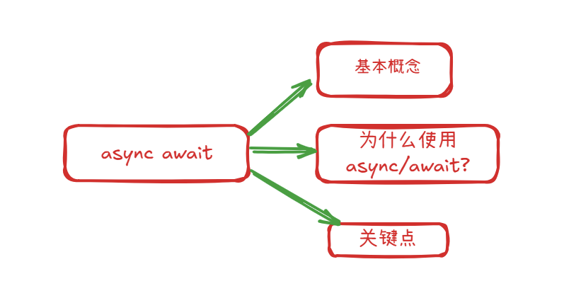

# async await

#### 基本使用


###### 基本概念

1.  **async 关键字**:

    -   当你用 async 关键字声明一个函数时，这个函数会自动返回一个 Promise 对象。
    -   即使函数内部没有显式返回一个 Promise，或者只是返回一个普通值（如数字、字符串），async 函数也会将这个返回值包装在一个已解决（resolved）的 Promise 中。
    -   如果函数内部抛出一个错误，async 函数会返回一个被拒绝（rejected）的 Promise，并将错误作为拒绝的原因。

1.  **await 关键字**:

    -   await 关键字只能在 async 函数内部使用（或者在现代 JavaScript 模块的顶层）。
    -   它用于等待一个 Promise 对象。当 JavaScript 引擎遇到 await 时，它会暂停当前 async 函数的执行，等待 await 后面的 Promise 解决（resolve）或拒绝（reject）。
    -   如果 Promise 解决，await 表达式会返回 Promise 的解决值。
    -   如果 Promise 拒绝，await 表达式会抛出 Promise 的拒绝原因（通常是一个 Error 对象）。你可以使用 try...catch 块来捕获这个错误。
    -   重要的是，当 async 函数因为 await 而暂停时，JavaScript 引擎并不会阻塞整个程序，而是可以去执行其他任务（事件循环机制）。

###### 为什么使用 async await

1.  **可读性强**：异步代码看起来更像同步代码，逻辑更清晰，易于理解和维护。
2.  **错误处理简单**：可以使用标准的 try...catch 结构来捕获来自 await 表达式（即 Promise 拒绝）的错误，这比 Promise 链中的 .catch() 更直观。
3.  **避免回调地狱 (Callback Hell)** ：相比于传统的回调函数嵌套，async/await 极大地扁平化了代码结构。
4.  **调试方便**：在调试器中，可以像同步代码一样单步执行 await 语句。

###### 关键的

-   async 函数总是返回一个 Promise。
-   await 只能在 async 函数内部使用（或模块顶层）。
-   await 会暂停 async 函数的执行，但不会阻塞整个 JavaScript 线程。
-   使用 try...catch 来处理 await 表达式可能抛出的错误。
-   async/await 是 Promise 的语法糖，底层仍然是 Promise 在工作。

#### 不同情况的基本使用

```js
// fun 1
async function foo1() {
  console.log('foo')
}

// fun 2
const foo2 = async function () {
  console.log('foo2')
}
// fun 3
const foo3 = async () => {
  console.log('foo3')
}

// fun 4
class Person{
  async foo5() {
    console.log('foo5')
  }
}
```

#### async 的返回值 四种 种的情况

1.  **返回一个非 Promise 值 (例如：数字、字符串、对象、undefined、null)**

    -   async 函数会自动将这个返回值包装在一个**已解决 (resolved)** 的 Promise 中。
    -   Promise 的解决值为你 return 的那个值。

    ```js
    async function getValue() {
      return 42; // 返回一个数字
    }

    getValue().then(value => {
      console.log(value); // 输出: 42
      console.log(getValue() instanceof Promise); // 输出: true
    });

    async function getUndefined() {
      // 没有显式 return，或者 return; 或者 return undefined;
    }

    getUndefined().then(value => {
      console.log(value); // 输出: undefined
    });

    async function getNull() {
      return null;
    }

    getNull().then(value => {
      console.log(value); // 输出: null
    });
        
    ```

1.  **返回一个 Promise 对象**

    -   如果 async 函数内部显式 return 了一个 Promise 对象，那么 async 函数的返回值就是**这个 Promise 对象本身**。它不会再进行额外的包装。
    -   这个返回的 Promise 的状态（resolved 或 rejected）和值/原因将直接决定 async 函数返回的 Promise 的状态和值/原因。

    ```js
    async function getPromiseResolved() {
      return Promise.resolve("Hello from Promise!");
    }

    getPromiseResolved().then(message => {
      console.log(message); // 输出: Hello from Promise!
    });

    async function getPromiseRejected() {
      return Promise.reject(new Error("Something went wrong in Promise!"));
    }

    getPromiseRejected()
      .then(value => console.log("Success:", value)) // 不会执行
      .catch(error => {
        console.error("Error:", error.message); // 输出: Error: Something went wrong in Promise!
      });

    async function getAwaitedPromise() {
      const p = new Promise(resolve => setTimeout(() => resolve("Awaited and resolved"), 100));
      return await p; // await 会解包 Promise，然后 async 再次包装
                      // 实际上，如果 return 的是 await p，等同于直接 return p
                      // 更准确地说，return await p; 会先等待 p 解决，
                      // 然后将 p 的解决值作为当前 async 函数的解决值进行包装返回。
                      // 如果 p 拒绝，则当前 async 函数返回的 Promise 也拒绝。
    }

    getAwaitedPromise().then(value => {
        console.log(value); // 输出: Awaited and resolved
    });
        
    ```


    **注意**: return await promise; 和 return promise; 在大多数情况下行为相似，但有一个细微差别：

    -   return promise;: 立即返回 promise。如果 promise 最终拒绝，调用者直接处理这个拒绝。
    -   return await promise;: 会等待 promise 解决或拒绝。如果 promise 拒绝，这个拒绝会像在 async 函数内部抛出错误一样，可以被 async 函数自身的 try...catch 捕获（如果外部没有 try...catch 包裹 await 的话）。最终 async 函数还是会返回一个新的 Promise，其状态与 promise 一致。

1.  **函数内部抛出错误 (throw new Error())**

    -   如果 async 函数内部（包括 await 表达式等待的 Promise 被拒绝且未被 try...catch 捕获时）抛出了一个错误，那么 async 函数会返回一个**被拒绝 (rejected)** 的 Promise。
    -   Promise 的拒绝原因就是抛出的那个错误对象。

    ```js
    async function throwError() {
      throw new Error("Intentional error!");
    }

    throwError()
      .then(value => console.log("Success:", value)) // 不会执行
      .catch(error => {
        console.error("Caught error:", error.message); // 输出: Caught error: Intentional error!
      });

    async function awaitRejectedPromise() {
      const p = Promise.reject(new Error("Awaited promise rejected!"));
      try {
        await p; // 这里会抛出错误
      } catch (err) {
        console.error("Caught internally:", err.message); // 可以内部捕获
        return "Recovered from error"; // 如果捕获并返回，则 async 函数返回 resolved Promise
      }
      // 如果没有 try...catch，错误会使 async 函数返回 rejected Promise
      // await p; // 如果这样写，且 p reject，则 async 函数返回 rejected Promise
    }

    awaitRejectedPromise().then(result => {
        console.log("Result of awaitRejectedPromise:", result); // 输出: Result of awaitRejectedPromise: Recovered from error
    });

    async function awaitRejectedPromiseNoCatch() {
        const p = Promise.reject(new Error("Awaited promise rejected, no catch!"));
        await p; // 这会导致 async 函数返回一个 rejected Promise
        console.log("This will not be reached"); // 不会执行
        return "Success"; // 不会执行
    }

    awaitRejectedPromiseNoCatch()
        .then(val => console.log("Success:", val))
        .catch(err => console.error("Caught externally:", err.message)); // 输出: Caught externally: Awaited promise rejected, no catch!
        
    ```


1.  **没有 return 语句（或者只有 return;）**

    -   与普通函数一样，如果 async 函数执行完毕而没有遇到显式的 return value; 语句（或者只有空的 return;），它会隐式返回 undefined。
    -   因此，async 函数会返回一个**已解决 (resolved)** 的 Promise，其解决值为 undefined。

    ```js
    async function noReturnValue() {
      console.log("Async function executed.");
      // 隐式 return undefined;
    }

    noReturnValue().then(value => {
      console.log(value); // 输出: undefined
    });
        
    ```


**总结表格：**

| async 函数内部操作                        | 返回的 Promise 状态       | Promise 的值/原因                  |
| ----------------------------------- | -------------------- | ------------------------------ |
| return `<non-promise-value>`;         | Resolved             | `<non-promise-value>`  
| return `<promise-object>`;            | (同 `<promise-object>`) | (同 `<promise-object>` 的解决值或拒绝原因) |
| throw `<error-object>`;               | Rejected             | `<error-object>`                 |
| await `<rejected-promise>`; (未捕获)     | Rejected             | `<rejected-promise>` 的拒绝原因       |
| 执行完毕，无显式 return `<value>`; (或return;) | Resolved             | undefined                      |


# 浏览器进程 线程
# 宏任务 微任务队列
# Pormise面试题
# throw try catch
# 浏览器储存 Storage