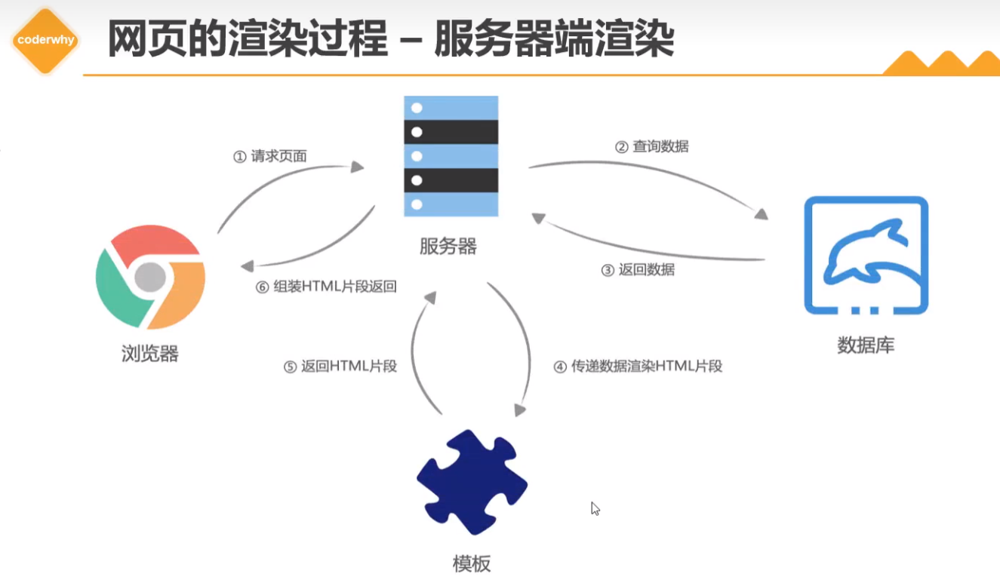
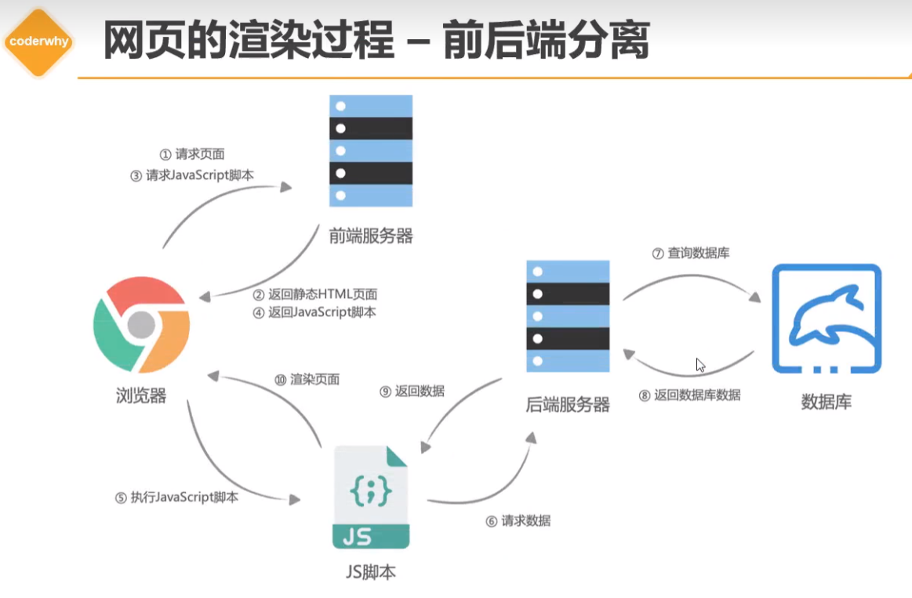
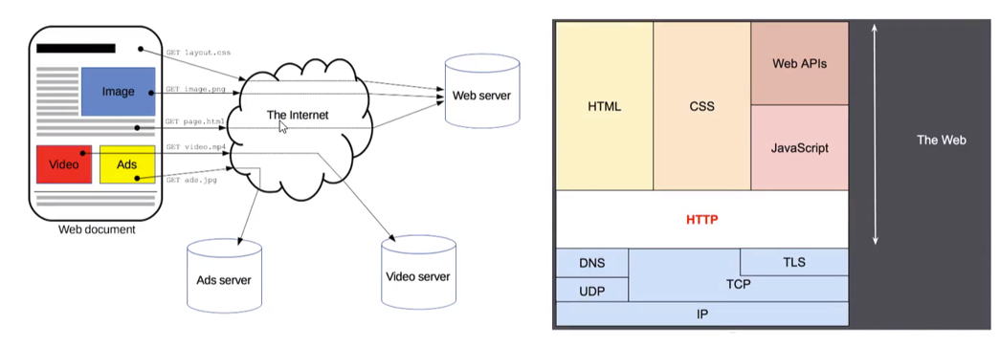
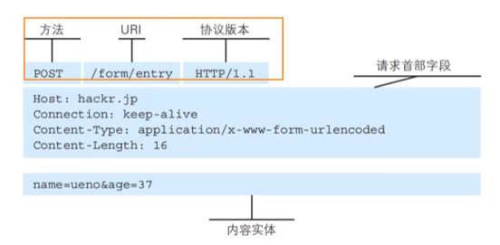
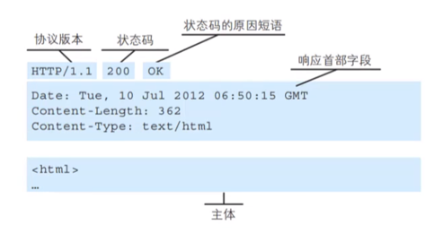

# 前端数据请求方式


## 服务器端渲染



## 前后端分离



前后端分离是一种将前端（用户界面）和后端（业务逻辑、数据处理）分离开发的架构模式，常见于现代Web开发中（如使用 React/Vue + Node.js/Java 等组合）。这种模式具有以下几个**主要优势**：

* * *

### 🧩 1. **开发效率提升**

-   **前后端并行开发**：后端提供 API 接口，前端根据接口文档进行开发，互不阻塞。
-   **分工明确**：前端专注于页面展示和用户交互，后端聚焦于业务逻辑和数据库操作。

* * *

### 🧪 2. **技术选型灵活**

-   前端可以使用任何框架（如 React、Vue、Angular），后端也可自由选择语言/框架（如 Node.js、Java、Python）。
-   更容易采用微服务架构、服务拆分等现代化架构模式。

* * *

### 🔧 3. **前端体验更佳**

-   **单页应用（SPA）更易实现**：前端控制路由，用户体验更流畅。
-   **性能优化更自由**：如懒加载、组件缓存等技术易于集成。

* * *

### 🔄 4. **接口标准化**

-   通过 RESTful 或 GraphQL 等标准接口通信，使系统结构更清晰、测试更方便。
-   可以方便地使用 Postman、Swagger 等工具进行接口调试和文档生成。

* * *

### 🔐 5. **安全性提升（一定程度）**

-   后端 API 统一管理权限和数据访问。
-   前端不直接接触数据库，有助于防止 SQL 注入等攻击。

* * *

### 📱 6. **多端复用**

-   同一个后端 API 可以服务多个前端，如 Web、移动端、小程序等。
-   降低重复开发成本。

* * *

### 🔍 示例对比

| 项目    | 传统后端渲染      | 前后端分离           |
| ----- | ----------- | --------------- |
| 页面渲染  | 后端模板渲染 HTML | 前端框架渲染          |
| 请求交互  | 表单提交+页面刷新   | Ajax/Fetch+局部更新 |
| 用户体验  | 页面频繁刷新      | 响应更快、更流畅        |
| 技术栈绑定 | 前后端耦合       | 前后端独立           |

* * *


#### 

# HTTP协议的解析

#### 什么是 HTTP
超文本传输协议（缩写：HTTP）是一种用于分布式、协作式和超媒体信息系统的应用层协议

HTTP是万维网的数据通信的基础，设计HTTP最初的目的是为了提供一种发布和接收HTML页面的方法；

通过HTTP或者HTTPS协议请求的资源由统一资源标识符）来标识

#### HTTP是一个客户端（用户）和服务端（网站）之间请求和响应的标准。


1. 通过使用网页浏览器、网络爬虫或者其它的工具，客户端发起一个HTTP请求到服务器上指定端口（默认端口为80）；

2. 我们称这个客户端为用户代理程序（useragent）；

3. 响应的服务器上存储着一些资源，比如HTML文件和图像。我们称这个响应服务器为源服务器（originserver）

#### 网页中资源的获取



# HTTP的组成

1. 一次请求包括：请求(Request) 和 响应(Response)


# 请求：Request



HTTP 请求由以下几个**组成部分**构成，主要包括：请求行、请求头、空行 和 请求体。下面详细介绍各部分的结构：

---

## 🌐 一、请求的组成结构

```js
<请求行>
<请求头部>
<空行>
<请求体>
```

---

## 📌 二、各部分详解

### 1️⃣ 请求行（Request Line）

格式如下：

```js
<方法> <请求路径> <HTTP版本>
```

例如：

```js
GET /index.html HTTP/1.1
```

* **方法**：如 `GET`、`POST`、`PUT`、`DELETE` 等
* **请求路径**：如 `/api/user/123`
* **HTTP版本**：如 `HTTP/1.1`

---

### 2️⃣ 请求头（Request Headers）

以 `key: value` 的格式提供额外信息，例如：

```js
Host: www.example.com
User-Agent: Mozilla/5.0
Accept: text/html
Content-Type: application/json
```

常见请求头：

| 请求头             | 作用                   |
| --------------- | -------------------- |
| `Host`          | 指定服务器域名              |
| `User-Agent`    | 客户端信息                |
| `Accept`        | 告诉服务器可以接收的数据类型       |
| `Content-Type`  | 请求体数据的类型（如 JSON、表单等） |
| `Authorization` | 携带认证信息（如 token）      |

---

### 3️⃣ 空行

* 请求头结束后必须有一个空行（即换行），表示接下来是请求体。
* 如果没有请求体（如 GET 请求），这个空行后就结束了。

---

### 4️⃣ 请求体（Request Body）

* 可选，用于携带提交的数据（如表单、JSON）。
* 常见于 `POST`、`PUT` 等方法。

例如一个 POST 请求体：

```json
{
  "username": "alice",
  "password": "123456"
}
```

---

## 🧪 示例：一个完整的 HTTP 请求

```js
POST /api/login HTTP/1.1
Host: www.example.com
Content-Type: application/json
Content-Length: 45

{
  "username": "alice",
  "password": "123456"
}
```

---

如果你正在学习 HTTP 或开发接口，有需要我再详细讲讲某一部分，比如请求方法的区别、常见请求头、抓包分析工具使用等，我也可以继续讲。需要吗？


# Request Header（请求头）

HTTP 的 **Request Header（请求头）** 是浏览器或客户端发送给服务器的一组键值对，用于说明客户端的请求信息，如客户端类型、支持的数据格式、认证信息等。

* * *

## ✅ Request Header 常见字段分类

下面是一些最常见和最实用的 Request Header 字段，按功能分类：

* * *

### 🧾 一、通用头（General Headers）

| 头部字段                        | 作用                                    |
| --------------------------- | ------------------------------------- |
| `Host`                      | 服务器主机名和端口号，例如：`Host: www.example.com` |
| `Connection`                | 控制连接是否保持，如 `keep-alive`               |
| `Cache-Control`             | 缓存控制策略，例如 `no-cache`、`max-age=3600`   |
| `Pragma`                    | 旧版 HTTP 缓存控制，一般为 `Pragma: no-cache`   |
| `Upgrade-Insecure-Requests` | 是否请求从 HTTP 升级到 HTTPS，值为 `1` 表示希望升级    |

* * *

### 🧑‍💻 二、客户端信息相关

| 头部字段              | 作用                           |
| ----------------- | ---------------------------- |
| `User-Agent`      | 客户端浏览器或应用的标识信息               |
| `Referer`         | 当前请求页面的来源页面 URL              |
| `Origin`          | 请求的源地址（常用于 CORS 跨域请求）        |
| `Accept-Language` | 客户端可接受的语言，如 `zh-CN, en-US`   |
| `Accept-Encoding` | 客户端支持的压缩编码，如 `gzip, deflate` |

* * *

### 📄 三、内容协商相关

| 头部字段             | 作用                                                                              |
| ---------------- | ------------------------------------------------------------------------------- |
| `Accept`         | 客户端希望接受的响应类型，例如：`application/json`                                              |
| `Content-Type`   | 请求体的数据格式（POST/PUT 时使用），如：`application/json`、`application/x-www-form-urlencoded` |
| `Content-Length` | 请求体的长度（字节数）                                                                     |

* * *

### 🔐 四、认证与授权

| 头部字段            | 作用                               |
| --------------- | -------------------------------- |
| `Authorization` | 携带身份认证信息（如 Basic 或 Bearer Token） |
| `Cookie`        | 向服务器发送客户端的 Cookie                |

* * *

### 📦 五、自定义头（一般以 `X-` 开头）

开发中常会使用一些自定义头：

| 头部字段               | 说明                              |
| ------------------ | ------------------------------- |
| `X-Requested-With` | 标识 AJAX 请求，常见值：`XMLHttpRequest` |
| `X-CSRF-Token`     | 用于防止跨站请求伪造（CSRF）                |
| `X-Auth-Token`     | 自定义身份令牌                         |

* * *

## 🧪 示例：一个典型的 Request Header

```js
GET /api/user HTTP/1.1
Host: api.example.com
User-Agent: Mozilla/5.0 (Windows NT 10.0; Win64; x64)
Accept: application/json
Content-Type: application/json
Authorization: Bearer abc123xyz
Cookie: sessionid=xyz456
```

* * *

如果你是在开发前后端接口，比如用 Postman 调试或用 Axios 发请求，了解 Request Header 可以帮助你解决很多问题（如跨域、认证失败、格式不匹配等）。需要我讲讲某些字段的用法或调试技巧吗？

# 响应：Response



HTTP 响应由四个主要部分组成，分别是：**状态行**、**响应头**、**空行**、**响应体**，结构和请求类似，但各字段有不同含义。

---

## 📦 HTTP 响应结构

```js
<状态行>
<响应头部>
<空行>
<响应体>
```

---

## 🔍 各部分详解

### 1️⃣ 状态行（Status Line）

格式如下：

```js
<HTTP版本> <状态码> <状态描述>
```

例如：

```js
HTTP/1.1 200 OK
```

* **HTTP版本**：如 HTTP/1.1、HTTP/2
* **状态码**：三位数字，表示响应结果
* **状态描述**：人类可读的状态文本

常见状态码：

| 状态码 | 含义        |
| --- | --------- |
| 200 | OK，请求成功   |
| 301 | 永久重定向     |
| 302 | 临时重定向     |
| 400 | 客户端请求错误   |
| 401 | 未授权（需要登录） |
| 403 | 禁止访问      |
| 404 | 未找到资源     |
| 500 | 服务器内部错误   |

---

### 2️⃣ 响应头（Response Headers）

响应头用于提供服务器和响应的相关信息，格式仍是 `key: value`。

常见响应头：

| 响应头              | 作用                                        |
| ---------------- | ----------------------------------------- |
| `Content-Type`   | 响应体的类型（如 `text/html`, `application/json`） |
| `Content-Length` | 响应体的长度（字节数）                               |
| `Set-Cookie`     | 向客户端设置 Cookie                             |
| `Cache-Control`  | 控制缓存行为                                    |
| `Server`         | 返回服务器的类型信息（如 nginx、Apache）                |

示例：

```js
Content-Type: application/json
Content-Length: 85
Set-Cookie: sessionid=abc123; Path=/; HttpOnly
```

---

### 3️⃣ 空行

* 一行空行，表示响应头结束。
* 接下来就是响应体。

---

### 4️⃣ 响应体（Response Body）

* 响应的实际内容，如 HTML 页面、JSON 数据、图片等。
* `Content-Type` 决定了内容的格式。

示例 JSON 响应体：

```json
{
  "message": "登录成功",
  "user": {
    "id": 1,
    "username": "alice"
  }
}
```

---

## ✅ 示例：完整 HTTP 响应

```js
HTTP/1.1 200 OK
Content-Type: application/json
Content-Length: 67

{
  "status": "success",
  "data": {
    "username": "alice"
  }
}
```

---


# Respones Header

HTTP 的 **Response Header（响应头）** 是服务器在响应请求时，返回给客户端的一组键值对，用于说明响应的相关信息，比如内容类型、长度、缓存策略、服务器信息、Cookie 设置等。

* * *

## ✅ Response Header 常见字段分类

* * *

### 📄 一、内容相关头（说明响应内容）

| 字段                    | 作用                                        |
| --------------------- | ----------------------------------------- |
| `Content-Type`        | 响应体的内容类型，如 `text/html`、`application/json` |
| `Content-Length`      | 响应体的字节长度                                  |
| `Content-Encoding`    | 对响应体的压缩方式，如 `gzip`、`br`                   |
| `Content-Disposition` | 控制内容在浏览器的呈现方式（如附件下载）                      |
| `Last-Modified`       | 资源的最后修改时间                                 |
| `ETag`                | 资源的唯一标识符，用于缓存验证                           |

* * *

### 🌐 二、跨域相关头（CORS）

| 字段                                 | 作用            |
| ---------------------------------- | ------------- |
| `Access-Control-Allow-Origin`      | 指定允许跨域的源      |
| `Access-Control-Allow-Methods`     | 指定允许的请求方法     |
| `Access-Control-Allow-Headers`     | 指定允许的请求头      |
| `Access-Control-Allow-Credentials` | 是否允许携带 Cookie |

* * *

### 🧠 三、缓存相关头

| 字段              | 作用                                 |
| --------------- | ---------------------------------- |
| `Cache-Control` | 控制缓存策略，如 `no-cache`、`max-age=3600` |
| `Expires`       | 设置缓存的过期时间（已不推荐，使用 `Cache-Control`） |
| `Vary`          | 指定哪些请求头影响缓存内容（如 `Accept-Encoding`） |

* * *

### 🔐 四、认证和安全相关

| 字段                          | 作用                            |
| --------------------------- | ----------------------------- |
| `Set-Cookie`                | 设置 Cookie 给客户端                |
| `WWW-Authenticate`          | 提示客户端提供身份凭证（用于 401）           |
| `Strict-Transport-Security` | 强制客户端使用 HTTPS（HSTS）           |
| `X-Content-Type-Options`    | 防止 MIME 类型混淆攻击（常设为 `nosniff`） |
| `X-Frame-Options`           | 防止网页被嵌套在 iframe 中（防点击劫持）      |
| `Content-Security-Policy`   | 控制网页资源加载策略（防 XSS 等）           |

* * *

### ⚙️ 五、服务器信息头

| 字段             | 作用                                |
| -------------- | --------------------------------- |
| `Server`       | 指示服务器软件信息（如 `nginx`, `Apache`）    |
| `Date`         | 响应生成的时间                           |
| `X-Powered-By` | 表明后端语言/框架（如 `PHP/7.4`, `Express`） |

* * *

## 🧪 示例：一个典型的 Response Header

```js
HTTP/1.1 200 OK
Content-Type: application/json
Content-Length: 85
Cache-Control: no-cache
Access-Control-Allow-Origin: *
Set-Cookie: sessionid=xyz123; Path=/; HttpOnly
Server: nginx/1.20.1
Date: Tue, 13 May 2025 10:00:00 GMT
```

* * *


# XHR的基本用法

### XHR 常用属性 (Properties)

这些属性用于获取请求状态、响应数据等信息。

1.  **readyState**: (只读) unsigned short

    -   描述：表示 XHR 请求的当前状态。

    -   值：

        -   0 (UNSENT): open() 尚未调用。
        -   1 (OPENED): open() 已被调用。
        -   2 (HEADERS_RECEIVED): send() 已被调用，并且头部和状态已经可获得。
        -   3 (LOADING): 下载中；responseText 属性已经包含部分数据。
        -   4 (DONE): 操作完成。

    -   用途：通常在 onreadystatechange 事件处理函数中使用，以确定请求是否完成。

1.  **status**: (只读) unsigned short

    -   描述：HTTP 响应的状态码 (例如 200 表示 "OK", 404 表示 "Not Found")。
    -   用途：在 readyState 为 4 (DONE) 时检查，以判断请求是否成功。

1.  **statusText**: (只读) DOMString

    -   描述：HTTP 响应的状态文本 (例如 "OK", "Not Found")。
    -   用途：提供状态码的可读描述。

1.  **responseText**: (只读) DOMString

    -   描述：服务器返回的响应文本。如果响应不是文本或请求未成功/完成，则可能为 null 或空字符串。
    -   用途：获取服务器返回的字符串数据 (如 HTML, plain text, JSON 字符串)。

1.  **responseXML**: (只读) Document

    -   描述：如果响应的 Content-Type 是 text/xml 或 application/xml，并且数据被成功解析为 XML，则此属性包含响应的 Document 对象。否则为 null。
    -   用途：获取和操作 XML 格式的响应数据。

1.  **response**: (只读) any

    -   描述：响应体。其类型由 responseType 属性决定。
    -   用途：获取特定类型的响应数据 (如 JSON 对象、Blob、ArrayBuffer)。

1.  **responseType**: DOMString

    -   描述：设置或获取期望的响应数据类型。
    -   值："" (等同于 "text"), "arraybuffer", "blob", "document", "json", "text"。
    -   用途：在 send() 之前设置，告诉 XHR 如何处理响应数据。例如，设为 "json" 后，xhr.response 会直接返回解析后的 JavaScript 对象。

1.  **responseURL**: (只读) DOMString

    -   描述：响应的序列化 URL，或者在 URL 为空时为空字符串。如果 URL 有重定向，这是最终的 URL。

1.  **timeout**: unsigned long

    -   描述：请求超时时间，以毫秒为单位。默认值为 0，表示没有超时。
    -   用途：设置请求在多长时间后自动中止。

1.  **withCredentials**: boolean

    -   描述：指示是否应使用 cookie、授权标头或 TLS 客户端证书等凭据发出跨站点访问控制请求。
    -   用途：对于需要携带 Cookie 的跨域请求，需要设置为 true。

1.  **upload**: (只读) XMLHttpRequestUpload

    -   描述：一个 XMLHttpRequestUpload 对象，代表上传过程。你可以为这个对象添加事件监听器 (如 onprogress, onload, onerror) 来跟踪上传进度。
    -   用途：监控文件上传进度。

* * *

### XHR 常用方法 (Methods)

这些方法用于配置、发送请求以及控制请求。

1.  **open(method, url[, async[, user[, password]]])**

    -   描述：初始化一个请求。

    -   参数：

        -   method: HTTP 请求方法 (如 "GET", "POST", "PUT", "DELETE")。
        -   url: 请求的 URL。
        -   async (可选): 布尔值，true (默认) 表示异步执行操作，false 表示同步。**强烈建议使用异步**。
        -   user (可选): 用于身份验证的用户名。
        -   password (可选): 用于身份验证的密码。

    -   注意：此方法必须在 send() 之前调用。

1.  **send(body)**

    -   描述：发送 HTTP 请求。

    -   参数：

        -   body (可选): 要在请求体中发送的数据。对于 GET 或 HEAD 方法，应为 null 或省略。可以是 Document, Blob, BufferSource, FormData, URLSearchParams, 或 USVString。

    -   注意：对于异步请求，此方法会立即返回。

1.  **setRequestHeader(header, value)**

    -   描述：设置 HTTP 请求头的值。

    -   参数：

        -   header: 请求头的名称 (字符串)。
        -   value: 请求头的值 (字符串)。

    -   注意：必须在 open() 之后、send() 之前调用。如果多次调用相同头部，新值会附加到旧值后面。

1.  **abort()**

    -   描述：中止当前请求。
    -   效果：readyState 变为 0 (UNSENT) 或 4 (DONE)，status 变为 0。会触发 abort 事件。

1.  **getResponseHeader(headerName)**

    -   描述：返回指定响应头的值。如果响应头不存在或请求未完成，则返回 null。

    -   参数：

        -   headerName: 要获取的响应头的名称 (不区分大小写)。

1.  **getAllResponseHeaders()**

    -   描述：返回一个包含所有响应头的字符串，每个头部之间由 CRLF (\r\n) 分隔。如果没有任何响应头或请求未完成，则返回 null 或空字符串。

1.  **overrideMimeType(mimeType)** (不常用，但有时有用)

    -   描述：覆盖服务器返回的 MIME 类型。

    -   参数：

        -   mimeType: 要使用的 MIME 类型字符串。

    -   注意：必须在 send() 之前调用。例如，如果服务器返回的 Content-Type 不正确，但你知道数据是 XML，可以调用 xhr.overrideMimeType('text/xml; charset=utf-8')。

* * *

### XHR 常用事件处理器 (Event Handlers)

这些是属性，可以为其分配函数来响应 XHR 对象的不同事件。

1.  **onreadystatechange**:

    -   描述：当 readyState 属性发生变化时调用的事件处理函数。

1.  **onload**:

    -   描述：当请求成功完成时触发 (即 readyState 为 4 且 status 在 200-299 范围内)。

1.  **onerror**:

    -   描述：当请求发生错误时触发 (例如网络错误，不会触发 onload)。

1.  **onprogress**:

    -   描述：当请求正在接收数据期间周期性地触发。可以用来显示下载进度。事件对象包含 loaded (已加载字节数) 和 total (总字节数，如果 Content-Length 可用)。

1.  **ontimeout**:

    -   描述：当请求因超过 timeout 属性设置的时间而中止时触发。

1.  **onloadstart**:

    -   描述：当请求开始加载数据时触发。

1.  **onloadend**:

    -   描述：当请求完成时触发，无论成功、失败或中止。在 onload、onerror、onabort 或 ontimeout 之后触发。

1.  **onabort**:

    -   描述：当请求被 abort() 方法中止时触发。


# XHR的进阶和封装
# Fetch的使用详情
# 前端文件的上传流程