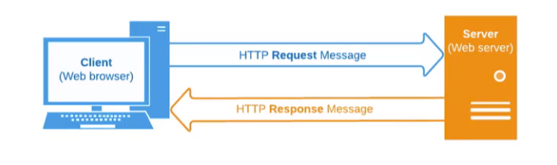

# 前端数据请求方式

## 服务器端渲染

## 前后端分离

前后端分离是一种将前端（用户界面）和后端（业务逻辑、数据处理）分离开发的架构模式，常见于现代Web开发中（如使用 React/Vue + Node.js/Java 等组合）。这种模式具有以下几个**主要优势**：

* * *

### 🧩 1. **开发效率提升**

-   **前后端并行开发**：后端提供 API 接口，前端根据接口文档进行开发，互不阻塞。
-   **分工明确**：前端专注于页面展示和用户交互，后端聚焦于业务逻辑和数据库操作。

* * *

### 🧪 2. **技术选型灵活**

-   前端可以使用任何框架（如 React、Vue、Angular），后端也可自由选择语言/框架（如 Node.js、Java、Python）。
-   更容易采用微服务架构、服务拆分等现代化架构模式。

* * *

### 🔧 3. **前端体验更佳**

-   **单页应用（SPA）更易实现**：前端控制路由，用户体验更流畅。
-   **性能优化更自由**：如懒加载、组件缓存等技术易于集成。

* * *

### 🔄 4. **接口标准化**

-   通过 RESTful 或 GraphQL 等标准接口通信，使系统结构更清晰、测试更方便。
-   可以方便地使用 Postman、Swagger 等工具进行接口调试和文档生成。

* * *

### 🔐 5. **安全性提升（一定程度）**

-   后端 API 统一管理权限和数据访问。
-   前端不直接接触数据库，有助于防止 SQL 注入等攻击。

* * *

### 📱 6. **多端复用**

-   同一个后端 API 可以服务多个前端，如 Web、移动端、小程序等。
-   降低重复开发成本。

* * *

### 🔍 示例对比

| 项目    | 传统后端渲染      | 前后端分离           |
| ----- | ----------- | --------------- |
| 页面渲染  | 后端模板渲染 HTML | 前端框架渲染          |
| 请求交互  | 表单提交+页面刷新   | Ajax/Fetch+局部更新 |
| 用户体验  | 页面频繁刷新      | 响应更快、更流畅        |
| 技术栈绑定 | 前后端耦合       | 前后端独立           |

* * *

#### 

# HTTP协议的解析

#### 什么是 HTTP
超文本传输协议（缩写：HTTP）是一种用于分布式、协作式和超媒体信息系统的应用层协议

HTTP是万维网的数据通信的基础，设计HTTP最初的目的是为了提供一种发布和接收HTML页面的方法；

通过HTTP或者HTTPS协议请求的资源由统一资源标识符）来标识

#### HTTP是一个客户端（用户）和服务端（网站）之间请求和响应的标准。

1. 通过使用网页浏览器、网络爬虫或者其它的工具，客户端发起一个HTTP请求到服务器上指定端口（默认端口为80）；

2. 我们称这个客户端为用户代理程序（useragent）；

3. 响应的服务器上存储着一些资源，比如HTML文件和图像。我们称这个响应服务器为源服务器（originserver）

#### 网页中资源的获取

#### HTTP的组成

1. 一次请求包括：请求(Request) 和 响应(Response)

# XHR的基本用法
# XHR的进阶和封装
# Fetch的使用详情
# 前端文件的上传流程